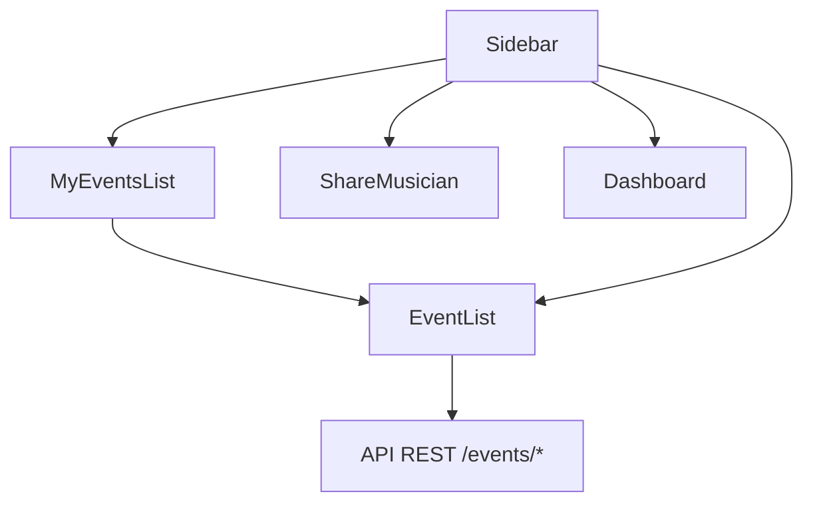

# 🏗️ Arquitectura del Proyecto - MussikOn

## 🎯 **Visión General**

MussikOn sigue una arquitectura modular basada en **Clean Architecture** y **Domain-Driven Design (DDD)**, optimizada para aplicaciones móviles con React Native y Expo. La arquitectura está diseñada para ser escalable, mantenible y fácil de entender.

## 🏛️ **Patrón Arquitectónico**

### Clean Architecture
La aplicación sigue los principios de Clean Architecture con las siguientes capas:

```
┌─────────────────────────────────────┐
│           Presentation Layer        │ ← React Components, Screens
├─────────────────────────────────────┤
│           Business Logic Layer      │ ← Services, Use Cases
├─────────────────────────────────────┤
│           Data Layer                │ ← APIs, Local Storage
└─────────────────────────────────────┘
```

### Principios Aplicados

1. **Separación de Responsabilidades**: Cada capa tiene una responsabilidad específica
2. **Dependencias Unidireccionales**: Las dependencias fluyen hacia adentro
3. **Independencia de Frameworks**: La lógica de negocio es independiente de React Native
4. **Testabilidad**: Cada capa puede ser testeada independientemente

## 📁 **Estructura de Carpetas**

```
src/
├── app/                    # Punto de entrada de la aplicación
│   └── App.tsx           # Componente raíz con configuración global
├── appTypes/              # Definiciones de tipos TypeScript
│   └── DatasTypes.ts     # Tipos compartidos de la aplicación
├── components/            # Componentes reutilizables
│   ├── ui/               # Componentes de interfaz básicos
│   ├── features/         # Componentes específicos de funcionalidades
│   ├── forms/            # Componentes de formularios
│   └── navigation/       # Componentes de navegación
├── screens/              # Pantallas de la aplicación
│   ├── auth/             # Pantallas de autenticación
│   ├── dashboard/        # Pantalla principal
│   ├── events/           # Pantallas de eventos
│   ├── profile/          # Pantallas de perfil
│   └── settings/         # Pantallas de configuración
├── services/             # Servicios y APIs
│   ├── api.ts           # Cliente HTTP configurado
│   └── events.ts        # Servicios específicos de eventos
├── store/                # Gestión de estado global (Redux)
│   ├── store.ts         # Configuración del store
│   └── slices/          # Slices de Redux por dominio
├── hooks/                # Custom hooks
│   └── useSocket.tsx    # Hook para WebSocket
├── utils/                # Utilidades y helpers
│   ├── functions.ts     # Funciones de utilidad
│   ├── auth.ts          # Utilidades de autenticación
│   └── socket.ts        # Utilidades de WebSocket
├── config/               # Configuración de la aplicación
│   └── environment.ts   # Variables de entorno
├── contexts/             # Contextos de React
│   └── LanguageContext.tsx # Contexto de idioma
├── i18n/                 # Internacionalización
│   ├── index.ts         # Configuración de i18next
│   └── locales/         # Archivos de traducción
├── theme/                # Sistema de diseño
│   ├── colors.ts        # Paleta de colores
│   ├── typography.ts    # Tipografías
│   ├── spacing.ts       # Espaciado
│   └── theme.ts         # Configuración de temas
├── styles/               # Estilos globales
│   ├── Styles.ts        # Estilos compartidos
│   └── media_responsive.ts # Responsive design
└── navigation/           # Configuración de navegación
    └── index.ts         # Configuración de rutas
```

## 🔄 **Flujo de Datos**

### 1. **Flujo de Autenticación**
```
Usuario → Login Screen → Auth Service → API → Secure Store → Redux Store → Navigation
```

### 2. **Flujo de Eventos**
```
Event Screen → Event Service → API → Redux Store → UI Update
```

### 3. **Flujo de Chat en Tiempo Real**
```
Socket Connection → Message Handler → Redux Store → UI Update
```

## 🎨 **Patrones de Diseño Implementados**

### 1. **Container/Presentational Pattern**
```typescript
// Container Component
const EventListContainer = () => {
  const events = useAppSelector(state => state.events.list);
  const dispatch = useAppDispatch();
  
  return <EventList events={events} onEventPress={handleEventPress} />;
};

// Presentational Component
const EventList = ({ events, onEventPress }) => {
  return (
    <FlatList
      data={events}
      renderItem={({ item }) => <EventCard event={item} onPress={onEventPress} />}
    />
  );
};
```

### 2. **Custom Hooks Pattern**
```typescript
// Hook personalizado para autenticación
export const useAuth = () => {
  const { isAuthenticated, user } = useAppSelector(state => state.auth);
  const dispatch = useAppDispatch();
  
  const login = async (credentials) => {
    // Lógica de login
  };
  
  const logout = () => {
    dispatch(logout());
  };
  
  return { isAuthenticated, user, login, logout };
};
```

### 3. **Service Layer Pattern**
```typescript
// Servicio de eventos
export const eventService = {
  async getEvents() {
    return apiService.get('/events');
  },
  
  async createEvent(eventData) {
    return apiService.post('/events', eventData);
  }
};
```

## 🗄️ **Gestión de Estado**

### Redux Toolkit
- **Store Centralizado**: Un solo store para toda la aplicación
- **Slices por Dominio**: Separación lógica por funcionalidad
- **DevTools**: Herramientas de desarrollo integradas

### Slices Implementados
1. **authSlice**: Estado de autenticación
2. **themeSlice**: Configuración de tema
3. **languageSlice**: Configuración de idioma
4. **notificationsSlice**: Notificaciones
5. **appSlice**: Estado general de la app
6. **formsSlice**: Estado de formularios

## 🔌 **Integración de APIs**

### Cliente HTTP Configurado
- **Axios**: Cliente HTTP principal
- **Interceptores**: Manejo automático de tokens
- **Reintentos**: Recuperación automática de errores
- **Timeouts**: Configuración de timeouts por endpoint

### WebSocket Integration
- **Socket.io**: Comunicación en tiempo real
- **Reconexión**: Reconexión automática
- **Eventos**: Sistema de eventos tipado

## 🌍 **Internacionalización**

### i18next Configuration
- **Detección Automática**: Idioma del dispositivo
- **Persistencia**: Guardado de preferencias
- **Fallbacks**: Idiomas de respaldo
- **Interpolación**: Variables dinámicas

## 🎨 **Sistema de Diseño**

### Design Tokens
- **Colores**: Paleta consistente
- **Tipografías**: Escala tipográfica
- **Espaciado**: Sistema de espaciado
- **Bordes**: Radio de bordes

### Temas
- **Light Theme**: Tema claro
- **Dark Theme**: Tema oscuro
- **Responsive**: Adaptación a diferentes pantallas

## 🔐 **Seguridad**

### Autenticación
- **JWT Tokens**: Tokens de autenticación
- **Secure Store**: Almacenamiento seguro
- **Token Refresh**: Renovación automática
- **Logout**: Limpieza de datos sensibles

### Validación
- **Frontend Validation**: Validación en cliente
- **Sanitización**: Limpieza de inputs
- **Error Handling**: Manejo seguro de errores

## 📱 **Navegación**

### React Navigation
- **Stack Navigator**: Navegación por stack
- **Tab Navigator**: Navegación por tabs
- **Drawer Navigator**: Menú lateral
- **Deep Linking**: Enlaces profundos

### Configuración de Rutas
```typescript
export type RootStackParamList = {
  Login: undefined;
  Home: undefined;
  Register: undefined;
  MainTabs: undefined;
  // ... más rutas
};
```

## 🧪 **Testing Strategy**

### Niveles de Testing
1. **Unit Tests**: Componentes individuales
2. **Integration Tests**: Servicios y APIs
3. **E2E Tests**: Flujos completos

### Herramientas
- **Jest**: Framework de testing
- **React Native Testing Library**: Testing de componentes
- **Mock Service Worker**: Mocking de APIs

## 📊 **Performance**

### Optimizaciones
- **Lazy Loading**: Carga diferida de componentes
- **Memoization**: React.memo y useMemo
- **Bundle Splitting**: División de código
- **Image Optimization**: Optimización de imágenes

### Métricas
- **Bundle Size**: < 50MB
- **Load Time**: < 3 segundos
- **Memory Usage**: < 200MB
- **FPS**: 60 FPS constante

## 🔄 **Ciclo de Desarrollo**

### 1. **Development**
```bash
npm start          # Iniciar en modo desarrollo
npm run android    # Ejecutar en Android
npm run ios        # Ejecutar en iOS
```

### 2. **Testing**
```bash
npm test           # Ejecutar tests
npm run test:watch # Tests en modo watch
```

### 3. **Build**
```bash
eas build --platform android  # Build para Android
eas build --platform ios      # Build para iOS
```

## 🚀 **Deployment**

### EAS Build
- **Configuración**: `eas.json`
- **Profiles**: Development, Preview, Production
- **Automation**: CI/CD integrado

### App Stores
- **Google Play Store**: Android
- **Apple App Store**: iOS
- **OTA Updates**: Actualizaciones sin store

## Pantalla "Mis Solicitudes" y Arquitectura

La pantalla **"Mis Solicitudes"** es un componente central de la arquitectura moderna de MussikOn. Permite a músicos y organizadores gestionar todas sus solicitudes/eventos en progreso desde un solo lugar, accesible desde el menú lateral.

- **Integración:**
  - Accesible desde el menú lateral para ambos roles.
  - Usa el componente reutilizable `EventList` en diferentes modos (pendientes, asignados/agendados, todos).
  - Consume los endpoints REST `/events/my-pending`, `/events/my-assigned`, `/events/my-scheduled`, `/events/my-events`.
  - UI moderna con tabs y feedback visual inmediato.

### Diagrama de Navegación (Mermaid)


- La arquitectura favorece la reutilización de componentes y la centralización de la gestión de solicitudes/eventos.

---

**Última actualización**: Diciembre 2024  
**Arquitecto**: Equipo de Desarrollo MussikOn  
**Versión de Arquitectura**: 2.0.0 