# 🔐 Sistema de Autenticación - MussikOn

## 📋 **Descripción General**

El sistema de autenticación de MussikOn está diseñado para proporcionar una experiencia segura y fluida para los usuarios. Implementa JWT (JSON Web Tokens) para la gestión de sesiones y utiliza Expo Secure Store para el almacenamiento seguro de credenciales.

## 🏗️ **Arquitectura del Sistema**

### Componentes Principales
```
┌─────────────────────────────────────┐
│           UI Layer                  │ ← Login/Register Screens
├─────────────────────────────────────┤
│           Auth Service              │ ← Lógica de autenticación
├─────────────────────────────────────┤
│           Token Management          │ ← JWT handling
├─────────────────────────────────────┤
│           Secure Storage            │ ← Expo Secure Store
└─────────────────────────────────────┘
```

## 🔧 **Implementación Técnica**

### 1. **Tipos de Datos**

```typescript
// src/appTypes/DatasTypes.ts
export type Token = {
  iat: number;           // Issued at timestamp
  name: string;          // Nombre del usuario
  lastName: string;      // Apellido del usuario
  userEmail: string;     // Email del usuario
  roll: string;          // Rol del usuario
}

export type User = {
  iat: number;
  name: string;
  lastName: string;
  userEmail: string;
  roll: string;
  create_at: string;
  update_at: string;
  delete_at: string;
  status: boolean;
};
```

### 2. **Gestión de Tokens**

```typescript
// src/utils/functions.ts
import * as SecureStore from 'expo-secure-store';
import { jwtDecode } from 'jwt-decode';

// Guardar token de forma segura
export const saveToken = async (token: string) => {
  try {
    await SecureStore.setItemAsync('token', token, {
      keychainAccessible: SecureStore.WHEN_UNLOCKED
    });
    console.log('Token guardado correctamente');
  } catch (error) {
    console.error('Error al guardar el token:', error);
    throw error;
  }
};

// Obtener token almacenado
export const getToken = async () => {
  try {
    const token = await SecureStore.getItemAsync('token');
    return token;
  } catch (error) {
    console.error('Error al obtener el token:', error);
    throw error;
  }
};

// Eliminar token
export const deleteToken = async () => {
  try {
    await SecureStore.deleteItemAsync('token');
    console.log('Token eliminado');
  } catch (error) {
    console.error('Error al eliminar el token:', error);
    throw error;
  }
};

// Validar token
export const validateToken = async () => {
  const token = await getToken();
  return !!token;
};

// Obtener datos del usuario desde el token
export const getData = async () => {
  try {
    const token = await getToken();
    if (!token) return null;
    const data: Token = jwtDecode(token);
    return data;
  } catch (error) {
    console.error('Error decodificando token:', error);
    return null;
  }
};
```

### 3. **Validación de Token Expirado**

```typescript
// src/utils/auth.ts
import * as SecureStore from 'expo-secure-store';
import { jwtDecode } from 'jwt-decode';

export const isTokenExpired = async (): Promise<boolean> => {
  try {
    const token = await SecureStore.getItemAsync('token');

    if (!token) {
      return true; // Si no hay token, se considera expirado
    }

    const decoded: any = jwtDecode(token);

    if (!decoded.exp) {
      return true; // Si no tiene fecha de expiración, se considera inválido
    }

    const currentTime = Math.floor(Date.now() / 1000); // Tiempo actual en segundos

    return decoded.exp < currentTime; // Retorna true si el token está vencido
  } catch (error) {
    console.error('Error verificando el token:', error);
    return true; // Si hay error, se asume que el token es inválido
  }
};
```

### 4. **Contexto de Usuario**

```typescript
// src/contexts/UserContext.tsx
import React, { createContext, useContext, useState, useEffect } from 'react';
import { getData, saveToken, deleteToken } from '@utils/functions';
import { User } from '@appTypes/DatasTypes';

interface UserContextType {
  user: User | null;
  login: (token: string) => Promise<void>;
  logout: () => Promise<void>;
  refreshUser: () => Promise<void>;
  loading: boolean;
}

const UserContext = createContext<UserContextType | undefined>(undefined);

export const UserProvider: React.FC<{ children: React.ReactNode }> = ({ children }) => {
  const [user, setUser] = useState<User | null>(null);
  const [loading, setLoading] = useState(true);

  const login = async (token: string) => {
    try {
      await saveToken(token);
      const userData = await getData();
      if (userData) {
        setUser(userData as User);
      }
    } catch (error) {
      console.error('Error en login:', error);
      throw error;
    }
  };

  const logout = async () => {
    try {
      await deleteToken();
      setUser(null);
    } catch (error) {
      console.error('Error en logout:', error);
      throw error;
    }
  };

  const refreshUser = async () => {
    try {
      const userData = await getData();
      setUser(userData as User);
    } catch (error) {
      console.error('Error refrescando usuario:', error);
      setUser(null);
    } finally {
      setLoading(false);
    }
  };

  useEffect(() => {
    refreshUser();
  }, []);

  return (
    <UserContext.Provider value={{ user, login, logout, refreshUser, loading }}>
      {children}
    </UserContext.Provider>
  );
};

export const useUser = () => {
  const context = useContext(UserContext);
  if (!context) {
    throw new Error('useUser must be used within UserProvider');
  }
  return context;
};
```

## 🖥️ **Pantallas de Autenticación**

### 1. **Pantalla de Login**

```typescript
// src/screens/auth/Login.tsx
import React, { useState, useEffect } from 'react';
import { View, Text, TextInput, TouchableOpacity, Alert } from 'react-native';
import { useTranslation } from 'react-i18next';
import { useTheme } from '@contexts/ThemeContext';
import { useUser } from '@contexts/UserContext';
import { URL_API } from '@utils/ENV';

const Login = ({ navigation }: any) => {
  const { t } = useTranslation();
  const { theme } = useTheme();
  const { login, user } = useUser();
  
  const [email, setEmail] = useState('');
  const [password, setPassword] = useState('');
  const [loading, setLoading] = useState(false);

  useEffect(() => {
    if (user) {
      navigation.replace('Home');
    }
  }, [user, navigation]);

  const handleLogin = async () => {
    if (!email || !password) {
      Alert.alert(t('login.error'), t('login.required'));
      return;
    }

    setLoading(true);

    try {
      const response = await fetch(`${URL_API}/auth/login`, {
        method: 'POST',
        headers: {
          'Content-Type': 'application/json',
        },
        body: JSON.stringify({
          userEmail: email,
          userPassword: password,
        }),
      });

      const data = await response.json();

      if (response.ok) {
        await login(data.token);
      } else {
        Alert.alert(t('login.error'), data.msg || t('login.connection_error'));
      }
    } catch (error) {
      Alert.alert(t('login.error'), t('login.connection_error'));
    } finally {
      setLoading(false);
    }
  };

  return (
    <View style={[styles.container, { backgroundColor: theme.colors.background.primary }]}>
      {/* UI del formulario de login */}
    </View>
  );
};
```

### 2. **Pantalla de Registro**

```typescript
// src/screens/auth/Register.tsx
import React, { useState } from 'react';
import { View, Text, TextInput, TouchableOpacity, Alert } from 'react-native';
import { useTranslation } from 'react-i18next';
import { useTheme } from '@contexts/ThemeContext';
import { validarEmail, validarPassword } from '@utils/functions';

const Register = ({ navigation }: any) => {
  const { t } = useTranslation();
  const { theme } = useTheme();
  
  const [formData, setFormData] = useState({
    name: '',
    lastName: '',
    email: '',
    confirmEmail: '',
    password: '',
    confirmPassword: '',
    roll: ''
  });
  const [loading, setLoading] = useState(false);

  const handleRegister = async () => {
    // Validaciones
    if (!validarEmail(formData.email)) {
      Alert.alert(t('register.error'), t('register.invalid'));
      return;
    }

    if (!validarPassword(formData.password)) {
      Alert.alert(t('register.error'), t('register.weak_password'));
      return;
    }

    if (formData.password !== formData.confirmPassword) {
      Alert.alert(t('register.error'), t('register.passwords_not_match'));
      return;
    }

    setLoading(true);

    try {
      const response = await fetch(`${URL_API}/auth/register`, {
        method: 'POST',
        headers: {
          'Content-Type': 'application/json',
        },
        body: JSON.stringify({
          name: formData.name,
          lastName: formData.lastName,
          userEmail: formData.email,
          userPassword: formData.password,
          roll: formData.roll
        }),
      });

      const data = await response.json();

      if (response.ok) {
        Alert.alert(
          t('register.registration_success'),
          t('register.understood'),
          [{ text: 'OK', onPress: () => navigation.navigate('Login') }]
        );
      } else {
        Alert.alert(t('register.registration_error'), data.msg);
      }
    } catch (error) {
      Alert.alert(t('register.registration_error'), t('register.connection_error'));
    } finally {
      setLoading(false);
    }
  };

  return (
    <View style={[styles.container, { backgroundColor: theme.colors.background.primary }]}>
      {/* UI del formulario de registro */}
    </View>
  );
};
```

## 🔒 **Seguridad**

### 1. **Validaciones de Entrada**

```typescript
// src/utils/functions.ts
export function validarPassword(password: string): boolean {
  const regex = /^(?=.*[a-z])(?=.*[A-Z])(?=.*\d)(?=.*[@$!%*?&.#])[A-Za-z\d@$!%*?&.#]{8,}$/;
  return regex.test(password);
}

export function validarEmail(email: string): boolean {
  const regex = /^[^\s@]+@[^\s@]+\.[^\s@]+$/;
  return regex.test(email);
}
```

### 2. **Manejo de Errores**

```typescript
// src/services/api.ts
import axios from 'axios';
import { getToken, deleteToken } from '../utils/functions';
import { store } from '../store/store';
import { logout } from '../store/slices/authSlice';

const api = axios.create({
  baseURL: API_URL,
  timeout: 10000,
});

// Interceptor para agregar token
api.interceptors.request.use(
  async (config) => {
    const token = await getToken();
    if (token) {
      config.headers.Authorization = `Bearer ${token}`;
    }
    return config;
  },
  (error) => {
    return Promise.reject(error);
  }
);

// Interceptor para manejar errores de autenticación
api.interceptors.response.use(
  (response) => response,
  async (error) => {
    if (error.response?.status === 401) {
      await deleteToken();
      store.dispatch(logout());
    }
    return Promise.reject(error);
  }
);
```

## 🌐 **Integración con APIs**

### 1. **Endpoints de Autenticación**

```typescript
// Endpoints principales
POST /auth/login     // Login de usuario
POST /auth/register  // Registro de usuario
POST /auth/logout    // Logout de usuario
GET  /auth/profile   // Obtener perfil de usuario
PUT  /auth/profile   // Actualizar perfil de usuario
```

### 2. **Estructura de Respuestas**

```typescript
// Respuesta exitosa de login
{
  "success": true,
  "token": "eyJhbGciOiJIUzI1NiIsInR5cCI6IkpXVCJ9...",
  "user": {
    "id": "123",
    "name": "Juan",
    "lastName": "Pérez",
    "email": "juan@example.com",
    "roll": "musico"
  }
}

// Respuesta de error
{
  "success": false,
  "message": "Credenciales inválidas",
  "code": "INVALID_CREDENTIALS"
}
```

## 🔄 **Flujo de Autenticación**

### 1. **Flujo de Login**

```mermaid
flowchart TD
    A[Usuario ingresa credenciales] --> B[Validar campos]
    B --> C{¿Campos válidos?}
    C -->|No| D[Mostrar error]
    C -->|Sí| E[Enviar request a API]
    E --> F{¿Respuesta exitosa?}
    F -->|No| G[Mostrar error de API]
    F -->|Sí| H[Guardar token]
    H --> I[Decodificar token]
    I --> J[Actualizar contexto de usuario]
    J --> K[Navegar a pantalla principal]
```



### 2. **Flujo de Registro**

```mermaid
flowchart TD
    A[Usuario llena formulario] --> B[Validar campos]
    B --> C{¿Campos válidos?}
    C -->|No| D[Mostrar errores]
    C -->|Sí| E[Enviar request a API]
    E --> F{¿Respuesta exitosa?}
    F -->|No| G[Mostrar error de API]
    F -->|Sí| H[Mostrar mensaje de éxito]
    H --> I[Navegar a login]
```



## 🎨 **UI/UX de Autenticación**

### 1. **Diseño de Pantallas**

- **Login**: Formulario simple con email y contraseña
- **Registro**: Formulario completo con validaciones
- **Recuperación**: Flujo para recuperar contraseña
- **Verificación**: Confirmación de email/teléfono

### 2. **Estados de UI**

```typescript
// Estados de carga
const [loading, setLoading] = useState(false);
const [showPassword, setShowPassword] = useState(false);
const [errors, setErrors] = useState({});

// Feedback visual
{loading && <LoadingSpinner />}
{errors.email && <Text style={styles.error}>{errors.email}</Text>}
```

### 3. **Accesibilidad**

```typescript
<TouchableOpacity
  accessible={true}
  accessibilityLabel="Botón de inicio de sesión"
  accessibilityRole="button"
  accessibilityHint="Presiona para iniciar sesión"
  onPress={handleLogin}
>
  <Text>Iniciar Sesión</Text>
</TouchableOpacity>
```

## 🔧 **Configuración**

### 1. **Variables de Entorno**

```typescript
// src/config/environment.ts
export const API_URL = process.env.API_URL || 'http://localhost:3000';
export const AUTH_ENDPOINTS = {
  LOGIN: '/auth/login',
  REGISTER: '/auth/register',
  LOGOUT: '/auth/logout',
  PROFILE: '/auth/profile'
};
```

### 2. **Configuración de Seguridad**

```typescript
// Configuración de Secure Store
const SECURE_STORE_CONFIG = {
  keychainAccessible: SecureStore.WHEN_UNLOCKED,
  requireAuthentication: false,
  authenticationPrompt: 'Acceder a credenciales'
};
```

## 📊 **Métricas y Monitoreo**

### 1. **Métricas de Seguridad**

- Tasa de éxito de login: 95%
- Tiempo promedio de autenticación: < 2 segundos
- Tasa de tokens expirados: < 1%
- Intentos fallidos de login: Monitoreados

### 2. **Logging**

```typescript
// Logging de eventos de autenticación
const logAuthEvent = (event: string, data?: any) => {
  console.log(`[AUTH] ${event}`, data);
  // Enviar a servicio de analytics
};
```

## 🚨 **Manejo de Errores**

### 1. **Tipos de Errores**

```typescript
enum AuthError {
  INVALID_CREDENTIALS = 'INVALID_CREDENTIALS',
  NETWORK_ERROR = 'NETWORK_ERROR',
  TOKEN_EXPIRED = 'TOKEN_EXPIRED',
  SERVER_ERROR = 'SERVER_ERROR',
  VALIDATION_ERROR = 'VALIDATION_ERROR'
}
```

### 2. **Estrategias de Recuperación**

- **Token expirado**: Logout automático y redirección a login
- **Error de red**: Reintentos automáticos con backoff exponencial
- **Credenciales inválidas**: Mensaje claro al usuario
- **Error del servidor**: Mensaje genérico con opción de reintentar

## 🔄 **Testing**

### 1. **Tests Unitarios**

```typescript
// __tests__/auth/Login.test.tsx
import { render, fireEvent, waitFor } from '@testing-library/react-native';
import Login from '../../src/screens/auth/Login';

describe('Login Screen', () => {
  it('should validate email format', () => {
    const { getByPlaceholderText, getByText } = render(<Login />);
    
    const emailInput = getByPlaceholderText('Email');
    fireEvent.changeText(emailInput, 'invalid-email');
    
    const loginButton = getByText('Iniciar Sesión');
    fireEvent.press(loginButton);
    
    expect(getByText('Email inválido')).toBeTruthy();
  });
});
```

### 2. **Tests de Integración**

```typescript
// __tests__/auth/authFlow.test.tsx
describe('Auth Flow', () => {
  it('should complete login flow successfully', async () => {
    // Test completo del flujo de login
  });
  
  it('should handle token expiration', async () => {
    // Test de manejo de token expirado
  });
});
```

## 📚 **Documentación Adicional**

### **Recursos Relacionados**
- [🔧 Configuración de API](./api/api-configuration.md)
- [🗄️ Gestión de Estado](./state-management/redux-store.md)
- [🌐 Internacionalización](./i18n/i18n-setup.md)
- [🎨 Componentes UI](./components/ui-components.md)

---

**Última actualización**: Diciembre 2024  
**Versión**: 2.0.0  
**Estado**: Implementado y documentado 