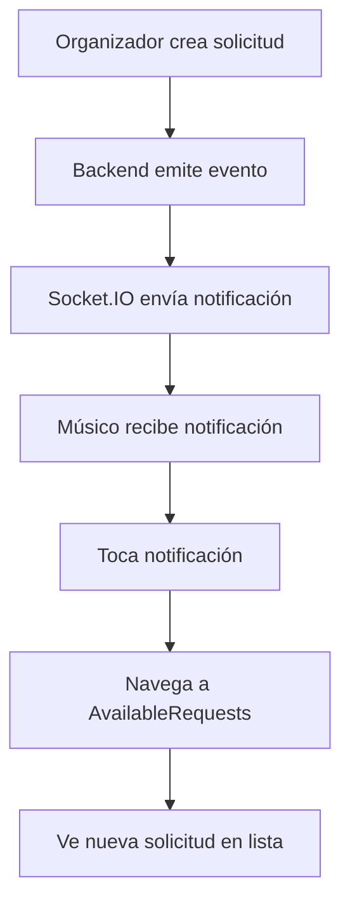

# 📋 Pantalla de Solicitudes Disponibles - AvailableRequestsScreen

## 📋 **Resumen Ejecutivo**

La pantalla `AvailableRequestsScreen` es una nueva funcionalidad diseñada específicamente para músicos, que les permite ver y gestionar todas las solicitudes de eventos disponibles en tiempo real. Esta pantalla complementa el sistema de notificaciones y proporciona una experiencia completa para que los músicos puedan encontrar y aceptar oportunidades de trabajo.

---

## 🎯 **Características Principales**

### ✅ **Funcionalidades Implementadas**
- **Lista en Tiempo Real** - Solicitudes disponibles actualizadas automáticamente
- **Filtrado Inteligente** - Solo solicitudes pendientes de músico
- **Aceptación Directa** - Botón para aceptar solicitudes con confirmación
- **Detalles Completos** - Información completa de cada solicitud
- **Navegación Intuitiva** - Acceso a detalles completos de cada solicitud
- **Feedback Visual** - Estados de loading y confirmaciones
- **Pull to Refresh** - Actualizar lista manualmente

---

## 🏗️ **Arquitectura de la Pantalla**

### 📱 **Componente Principal**

```typescript
// src/screens/events/AvailableRequestsScreen.tsx
interface AvailableRequestsScreenProps {
  navigation: any;
}

const AvailableRequestsScreen: React.FC<AvailableRequestsScreenProps> = ({ navigation }) => {
  const { theme } = useTheme();
  const { user } = useUser();
  const insets = useSafeAreaInsets();
  
  const [requests, setRequests] = useState<Request[]>([]);
  const [loading, setLoading] = useState(true);
  const [refreshing, setRefreshing] = useState(false);
  const [acceptingRequest, setAcceptingRequest] = useState<string | null>(null);

  useEffect(() => {
    loadAvailableRequests();
  }, []);

  const loadAvailableRequests = async () => {
    try {
      setLoading(true);
      const response = await requestService.getAvailableRequests();
      if (response.data) {
        setRequests(response.data);
      }
    } catch (error: any) {
      console.error('Error loading available requests:', error);
      Alert.alert('Error', 'No se pudieron cargar las solicitudes disponibles');
    } finally {
      setLoading(false);
    }
  };

  const handleAcceptRequest = async (request: Request) => {
    Alert.alert(
      'Aceptar Solicitud',
      `¿Estás seguro de que quieres aceptar la solicitud "${request.name}"?`,
      [
        { text: 'Cancelar', style: 'cancel' },
        {
          text: 'Aceptar',
          style: 'default',
          onPress: async () => {
            try {
              setAcceptingRequest(request.id);
              
              // Feedback táctil
              if (Platform.OS === 'ios') {
                Haptics.impactAsync(Haptics.ImpactFeedbackStyle.Medium);
              }

              const response = await requestService.acceptRequest(request.id);
              
              if (response.success) {
                Alert.alert(
                  '¡Solicitud Aceptada!',
                  'Has aceptado la solicitud exitosamente. El organizador será notificado.',
                  [
                    {
                      text: 'Ver Detalles',
                      onPress: () => {
                        navigation.navigate('RequestDetail', { requestId: request.id });
                      },
                    },
                    {
                      text: 'Continuar',
                      style: 'cancel',
                    },
                  ]
                );
                
                // Recargar lista
                await loadAvailableRequests();
              } else {
                Alert.alert('Error', response.message || 'No se pudo aceptar la solicitud');
              }
            } catch (error: any) {
              console.error('Error accepting request:', error);
              Alert.alert('Error', 'No se pudo aceptar la solicitud');
            } finally {
              setAcceptingRequest(null);
            }
          },
        },
      ]
    );
  };

  const handleViewDetails = (request: Request) => {
    navigation.navigate('RequestDetail', { requestId: request.id });
  };

  return (
    <View style={[styles.container, { backgroundColor: theme.colors.background.primary }]}>
      {/* Header */}
      <View style={[styles.header, { paddingTop: insets.top + 12 }]}>
        <View style={styles.headerContent}>
          <Text style={[styles.headerTitle, { color: theme.colors.text.primary }]}>
            Solicitudes Disponibles
          </Text>
          <Text style={[styles.headerSubtitle, { color: theme.colors.text.secondary }]}>
            Solicitudes de músicos disponibles para aceptar
          </Text>
        </View>
      </View>

      {/* Requests List */}
      <FlatList
        data={requests}
        renderItem={renderRequestCard}
        keyExtractor={(item) => item.id}
        contentContainerStyle={styles.listContainer}
        refreshControl={
          <RefreshControl
            refreshing={refreshing}
            onRefresh={onRefresh}
            colors={[theme.colors.primary[500]]}
          />
        }
        ListEmptyComponent={
          <View style={styles.emptyContainer}>
            <Ionicons name="musical-notes" size={64} color={theme.colors.text.tertiary} />
            <Text style={[styles.emptyTitle, { color: theme.colors.text.secondary }]}>
              No hay solicitudes disponibles
            </Text>
            <Text style={[styles.emptyMessage, { color: theme.colors.text.tertiary }]}>
              Cuando haya solicitudes disponibles, aparecerán aquí
            </Text>
          </View>
        }
      />
    </View>
  );
};
```

### 🎨 **Renderizado de Cards**

```typescript
const renderRequestCard = ({ item: request }: { item: Request }) => (
  <View style={[
    styles.requestCard,
    { 
      backgroundColor: theme.colors.background.card,
      borderColor: theme.colors.border.primary,
    }
  ]}>
    {/* Header */}
    <View style={styles.cardHeader}>
      <View style={styles.cardTitleContainer}>
        <Text style={[styles.cardTitle, { color: theme.colors.text.primary }]}>
          {request.name}
        </Text>
        <View style={[
          styles.statusBadge,
          { backgroundColor: getStatusColor(request.status) }
        ]}>
          <Text style={styles.statusText}>
            {getStatusText(request.status)}
          </Text>
        </View>
      </View>
      <TouchableOpacity
        onPress={() => handleViewDetails(request)}
        style={styles.detailsButton}
      >
        <Ionicons name="chevron-forward" size={20} color={theme.colors.text.tertiary} />
      </TouchableOpacity>
    </View>

    {/* Información Principal */}
    <View style={styles.cardContent}>
      {/* Fecha y Hora */}
      <View style={styles.infoRow}>
        <Ionicons name="calendar" size={16} color={theme.colors.primary[500]} />
        <Text style={[styles.infoText, { color: theme.colors.text.secondary }]}>
          {formatDate(request.date)} - {formatTime(request.time)}
        </Text>
      </View>

      {/* Ubicación */}
      <View style={styles.infoRow}>
        <Ionicons name="location" size={16} color={theme.colors.primary[500]} />
        <Text style={[styles.infoText, { color: theme.colors.text.secondary }]}>
          {request.location.address}
        </Text>
      </View>

      {/* Instrumento */}
      <View style={styles.infoRow}>
        <Ionicons name="musical-notes" size={16} color={theme.colors.primary[500]} />
        <Text style={[styles.infoText, { color: theme.colors.text.secondary }]}>
          {request.instrument}
        </Text>
      </View>

      {/* Presupuesto */}
      <View style={styles.infoRow}>
        <Ionicons name="cash" size={16} color={theme.colors.primary[500]} />
        <Text style={[styles.infoText, { color: theme.colors.text.secondary }]}>
          ${request.budget.toLocaleString()}
        </Text>
      </View>

      {/* Duración */}
      <View style={styles.infoRow}>
        <Ionicons name="hourglass" size={16} color={theme.colors.primary[500]} />
        <Text style={[styles.infoText, { color: theme.colors.text.secondary }]}>
          {request.duration} horas
        </Text>
      </View>

      {/* Comentarios */}
      {(request.comments || request.additionalComments) && (
        <View style={styles.commentsContainer}>
          <Ionicons name="chatbubble-outline" size={16} color={theme.colors.primary[500]} />
          <Text style={[styles.commentsText, { color: theme.colors.text.tertiary }]}>
            {request.comments || request.additionalComments}
          </Text>
        </View>
      )}
    </View>

    {/* Botones de Acción */}
    <View style={styles.cardActions}>
      <TouchableOpacity
        onPress={() => handleViewDetails(request)}
        style={[
          styles.actionButton,
          styles.secondaryButton,
          { borderColor: theme.colors.border.primary }
        ]}
      >
        <Ionicons name="eye" size={16} color={theme.colors.primary[500]} />
        <Text style={[styles.actionButtonText, { color: theme.colors.primary[500] }]}>
          Ver Detalles
        </Text>
      </TouchableOpacity>

      <TouchableOpacity
        onPress={() => handleAcceptRequest(request)}
        disabled={acceptingRequest === request.id}
        style={[
          styles.actionButton,
          styles.primaryButton,
          { backgroundColor: theme.colors.primary[500] },
          acceptingRequest === request.id && styles.disabledButton
        ]}
      >
        {acceptingRequest === request.id ? (
          <ActivityIndicator size="small" color="#fff" />
        ) : (
          <>
            <Ionicons name="checkmark" size={16} color="#fff" />
            <Text style={[styles.actionButtonText, { color: '#fff' }]}>
              Aceptar
            </Text>
          </>
        )}
      </TouchableOpacity>
    </View>
  </View>
);
```

---

## 🔄 **Flujo de Usuario**

### 📱 **1. Acceso a la Pantalla**
```mermaid
flowchart TD
    A[Músico abre app] --> B{¿Hay notificación?}
    B -->|Sí| C[Toca notificación]
    B -->|No| D[Va a MyRequestsList]
    C --> E[Navega a AvailableRequests]
    D --> F[Toca "Ver Disponibles"]
    F --> E
    E --> G[Carga solicitudes disponibles]
```

### 🎯 **2. Interacción con Solicitudes**
```mermaid
flowchart TD
    A[Ve lista de solicitudes] --> B{¿Interesado?}
    B -->|Sí| C[Toca "Ver Detalles"]
    B -->|No| D[Continúa explorando]
    C --> E[Ve información completa]
    E --> F{¿Aceptar?}
    F -->|Sí| G[Toca "Aceptar"]
    F -->|No| H[Regresa a lista]
    G --> I[Confirmación]
    I --> J[Envía aceptación]
    J --> K[Notifica al organizador]
    K --> L[Actualiza lista]
```

### 🔔 **3. Integración con Notificaciones**


---

## 🎨 **Diseño y UI/UX**

### 🎯 **Principios de Diseño**
- **Claridad**: Información esencial visible de inmediato
- **Accesibilidad**: Botones grandes y texto legible
- **Consistencia**: Mismo estilo que otras pantallas
- **Feedback**: Estados claros para cada acción

### 🎨 **Elementos Visuales**

#### **Header**
- **Título**: "Solicitudes Disponibles"
- **Subtítulo**: Explicación del propósito
- **Diseño**: Limpio y minimalista

#### **Cards de Solicitud**
- **Información Principal**: Nombre, fecha, ubicación
- **Información Secundaria**: Instrumento, presupuesto, duración
- **Comentarios**: Información adicional si existe
- **Acciones**: Botones "Ver Detalles" y "Aceptar"

#### **Estados Visuales**
- **Loading**: Spinner durante carga
- **Empty**: Mensaje cuando no hay solicitudes
- **Error**: Mensaje de error con opción de reintentar
- **Accepting**: Loading en botón durante aceptación

### 🎯 **Accesibilidad**
- **Touch Targets**: Mínimo 44x44 puntos
- **Contraste**: Cumple estándares WCAG
- **Texto**: Tamaños legibles
- **Iconos**: Con etiquetas de texto

---

## 🔧 **Integración Técnica**

### 📱 **Navegación**
```typescript
// Agregado al stack de navegación
<Stack.Screen 
  name="AvailableRequests" 
  component={AvailableRequestsScreen} 
  options={{ title: 'Solicitudes Disponibles' }} 
/>
```

### 🔌 **Servicios Utilizados**
```typescript
// Servicios principales
import { requestService } from '@services/requests';
import { useTheme } from '@contexts/ThemeContext';
import { useUser } from '@contexts/UserContext';

// Funciones principales
const loadAvailableRequests = async () => {
  const response = await requestService.getAvailableRequests();
  setRequests(response.data);
};

const handleAcceptRequest = async (request: Request) => {
  const response = await requestService.acceptRequest(request.id);
  // Manejar respuesta
};
```

### 🔄 **Estados de la Pantalla**
```typescript
interface AvailableRequestsState {
  requests: Request[];
  loading: boolean;
  refreshing: boolean;
  acceptingRequest: string | null;
  error: string | null;
}
```

---

## 📊 **Datos y Estructura**

### 📋 **Información Mostrada**
```typescript
interface Request {
  id: string;
  name: string;
  requestType: string;
  eventType?: string;
  date: string;
  time: string;
  location: {
    address: string;
    latitude: number;
    longitude: number;
  };
  duration: number;
  instrument: string;
  budget: number;
  comments?: string;
  additionalComments?: string;
  status: 'pending_musician' | 'musician_assigned' | 'completed' | 'cancelled';
}
```

### 🎯 **Filtrado de Datos**
- **Estado**: Solo solicitudes con `status: 'pending_musician'`
- **Orden**: Por fecha de creación (más recientes primero)
- **Límite**: Máximo 50 solicitudes por página

---

## 🚀 **Optimizaciones Implementadas**

### ⚡ **Performance**
- **FlatList**: Renderizado optimizado para listas largas
- **Lazy Loading**: Carga bajo demanda
- **Memoización**: Componentes optimizados
- **Debounce**: Evitar múltiples llamadas

### 🔄 **Experiencia de Usuario**
- **Pull to Refresh**: Actualizar manualmente
- **Feedback Táctil**: Vibración en iOS
- **Estados de Loading**: Indicadores claros
- **Manejo de Errores**: Mensajes informativos

### 🎯 **Accesibilidad**
- **Touch Targets**: Tamaños adecuados
- **Contraste**: Cumple estándares
- **Navegación**: Con teclado y lectores
- **Texto Alternativo**: Para iconos

---

## 📊 **Métricas y Analytics**

### 📈 **Eventos Rastreados**
- **Pantalla Abierta**: Cuando músico accede
- **Solicitud Vista**: Al ver detalles
- **Solicitud Aceptada**: Al aceptar
- **Tiempo de Respuesta**: Desde notificación hasta acción

### 📊 **KPIs Principales**
- **Tasa de Apertura**: Porcentaje de solicitudes vistas
- **Tasa de Aceptación**: Porcentaje de solicitudes aceptadas
- **Tiempo de Respuesta**: Velocidad de respuesta
- **Satisfacción**: Feedback del usuario

---

## 🔮 **Roadmap y Mejoras Futuras**

### 🚀 **Próximas Funcionalidades**
- **Filtros Avanzados**: Por instrumento, ubicación, presupuesto
- **Búsqueda**: Buscar en solicitudes
- **Favoritos**: Marcar solicitudes de interés
- **Notificaciones Push**: Para nuevas solicitudes

### 🎨 **Mejoras de UI/UX**
- **Mapa**: Ver ubicaciones en mapa
- **Filtros Visuales**: Chips para filtros
- **Animaciones**: Transiciones más fluidas
- **Modo Offline**: Ver solicitudes guardadas

### 🔧 **Mejoras Técnicas**
- **Caché Inteligente**: Guardar solicitudes localmente
- **Sincronización**: Sincronizar en segundo plano
- **Performance**: Optimizaciones avanzadas
- **Testing**: Tests automatizados

---

## 📚 **Referencias y Recursos**

### 📖 **Documentación Relacionada**
- [Sistema de Notificaciones](./notification-system.md)
- [Flujo del Músico](./solicitud-musico-flujo-musico.md)
- [Navegación Inteligente](./navigation-system.md)
- [Servicios de Requests](./request-services.md)

### 🛠️ **Herramientas Utilizadas**
- **React Navigation**: Navegación entre pantallas
- **FlatList**: Renderizado optimizado
- **AsyncStorage**: Persistencia local
- **Expo Haptics**: Feedback táctil

---

## ✅ **Estado de Implementación**

### 🎯 **Completado (100%)**
- ✅ **Pantalla Principal**: Funcionalidad completa
- ✅ **Lista de Solicitudes**: Renderizado optimizado
- ✅ **Aceptación de Solicitudes**: Con confirmación
- ✅ **Navegación a Detalles**: Acceso completo
- ✅ **Integración con Notificaciones**: Flujo completo
- ✅ **UI/UX Moderna**: Diseño consistente

### 🔄 **En Desarrollo**
- 🔄 **Filtros Avanzados**: Por instrumento y ubicación
- 🔄 **Búsqueda**: Buscar en solicitudes
- 🔄 **Analytics**: Métricas detalladas

### 📋 **Pendiente**
- ⏳ **Modo Offline**: Sincronización completa
- ⏳ **Testing**: Tests automatizados
- ⏳ **Performance**: Optimizaciones avanzadas 