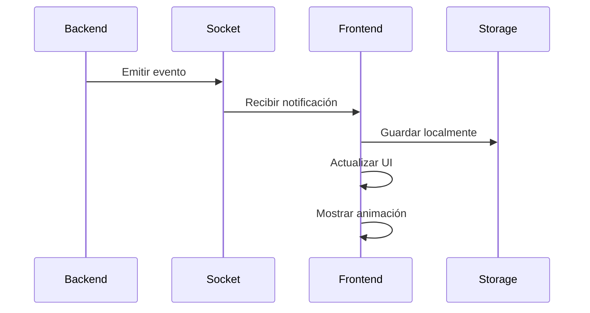

# 🔔 Sistema de Notificaciones - MussikOn

## 📋 **Resumen Ejecutivo**

El sistema de notificaciones de MussikOn es una implementación avanzada que combina **notificaciones en tiempo real** con **persistencia local** para proporcionar una experiencia de usuario fluida y confiable. El sistema está completamente integrado con Socket.IO y AsyncStorage para garantizar que los usuarios nunca pierdan información importante.

---

## 🎯 **Características Principales**

### ✅ **Funcionalidades Implementadas**
- **Notificaciones en Tiempo Real** - Socket.IO para comunicación instantánea
- **Persistencia Local** - AsyncStorage para notificaciones offline
- **Botón Flotante** - Indicador visual en header con contador
- **Pantalla Dedicada** - Gestión completa de notificaciones
- **Navegación Contextual Inteligente** - Acceso directo según tipo de notificación
- **Marcado como Leídas** - Individual y masivo
- **Eliminación** - Individual y masiva
- **Animaciones** - Feedback visual con animaciones suaves

---

## 🏗️ **Arquitectura del Sistema**

### 📱 **Frontend Components**

#### **1. FloatingNotificationButton**
```typescript
// src/components/notifications/FloatingNotificationButton.tsx
interface FloatingNotificationButtonProps {
  onPress: () => void;
}

const FloatingNotificationButton: React.FC<FloatingNotificationButtonProps> = ({ onPress }) => {
  const [unreadCount, setUnreadCount] = useState(0);
  const [pulseAnim] = useState(new Animated.Value(1));

  // Animación de pulso cuando hay notificaciones
  const startPulseAnimation = () => {
    Animated.loop(
      Animated.sequence([
        Animated.timing(pulseAnim, {
          toValue: 1.1,
          duration: 1000,
          useNativeDriver: true,
        }),
        Animated.timing(pulseAnim, {
          toValue: 1,
          duration: 1000,
          useNativeDriver: true,
        }),
      ])
    ).start();
  };

  return (
    <Animated.View style={[styles.container, { transform: [{ scale: pulseAnim }] }]}>
      <TouchableOpacity style={styles.button} onPress={onPress}>
        <Ionicons name="notifications" size={18} color="#fff" />
        {unreadCount > 0 && (
          <View style={styles.badge}>
            <Text style={styles.badgeText}>
              {unreadCount > 99 ? '99+' : unreadCount.toString()}
            </Text>
          </View>
        )}
      </TouchableOpacity>
    </Animated.View>
  );
};
```

#### **2. NotificationsScreen**
```typescript
// src/screens/notifications/NotificationsScreen.tsx
const NotificationsScreen: React.FC = () => {
  const [notifications, setNotifications] = useState<Notification[]>([]);
  const [loading, setLoading] = useState(true);

  useEffect(() => {
    loadNotifications();
  }, []);

  const loadNotifications = async () => {
    try {
      const storedNotifications = await notificationService.getNotifications();
      setNotifications(storedNotifications);
    } catch (error) {
      console.error('Error al cargar notificaciones:', error);
    } finally {
      setLoading(false);
    }
  };

  const handleNotificationPress = (notification: Notification) => {
    // Marcar como leída
    handleMarkAsRead(notification);
    
    // Navegación inteligente según tipo de notificación
    if (notification.type === 'new_event_request') {
      // Para notificaciones de nuevas solicitudes, ir a la pantalla de solicitudes disponibles
      navigation.navigate('AvailableRequests');
    } else if (notification.eventId) {
      // Para otras notificaciones con eventId, navegar a detalles de la solicitud
      navigation.navigate('RequestDetail', { requestId: notification.eventId });
    } else {
      // Si no tiene eventId, ir a la lista de solicitudes
      navigation.navigate('MyRequestsList');
    }
  };

  return (
    <View style={styles.container}>
      <Header title="Notificaciones" />
      {loading ? (
        <LoadingSpinner />
      ) : (
        <FlatList
          data={notifications}
          keyExtractor={(item) => item.id}
          renderItem={({ item }) => (
            <NotificationItem
              notification={item}
              onPress={() => handleNotificationPress(item)}
              onDelete={() => deleteNotification(item.id)}
            />
          )}
        />
      )}
    </View>
  );
};
```

#### **3. NotificationItem**
```typescript
// src/components/notifications/NotificationItem.tsx
interface NotificationItemProps {
  notification: Notification;
  onPress: () => void;
  onDelete: () => void;
}

const NotificationItem: React.FC<NotificationItemProps> = ({
  notification,
  onPress,
  onDelete,
}) => {
  const { theme } = useTheme();

  const getNotificationIcon = () => {
    switch (notification.type) {
      case 'request_cancelled':
        return 'close-circle';
      case 'request_cancelled_by_musician':
        return 'musical-notes';
      case 'request_deleted':
        return 'trash';
      case 'musician_accepted':
        return 'checkmark-circle';
      case 'new_event_request':
        return 'add-circle';
      default:
        return 'notifications';
    }
  };

  const getNotificationColor = () => {
    switch (notification.type) {
      case 'request_cancelled':
      case 'request_cancelled_by_musician':
      case 'request_deleted':
        return theme.colors.error[500];
      case 'musician_accepted':
        return theme.colors.success[500];
      case 'new_event_request':
        return theme.colors.primary[500];
      default:
        return theme.colors.primary[500];
    }
  };

  return (
    <TouchableOpacity
      style={[
        styles.container,
        { backgroundColor: theme.colors.background.card },
        !notification.read && styles.unread,
      ]}
      onPress={onPress}
    >
      <View style={styles.iconContainer}>
        <Ionicons
          name={getNotificationIcon()}
          size={24}
          color={getNotificationColor()}
        />
      </View>
      <View style={styles.content}>
        <Text style={styles.title}>{notification.title}</Text>
        <Text style={styles.message}>{notification.message}</Text>
        <Text style={styles.timestamp}>
          {formatTimestamp(notification.timestamp)}
        </Text>
      </View>
      <TouchableOpacity style={styles.deleteButton} onPress={onDelete}>
        <Ionicons name="trash" size={20} color={theme.colors.text.secondary} />
      </TouchableOpacity>
    </TouchableOpacity>
  );
};
```

### 🔌 **Backend Services**

#### **1. NotificationService**
```typescript
// app_mussikon_express/src/services/NotificationService.ts
export class NotificationService {
  private io: any;

  constructor(io: any) {
    this.io = io;
  }

  async sendNewRequestNotification(event: Event) {
    try {
      // Buscar músicos disponibles
      const availableMusicians = await this.getAvailableMusicians();
      
      // Enviar notificación a todos los músicos conectados
      availableMusicians.forEach(musician => {
        this.io.to(musician.socketId).emit('new_event_request', {
          eventId: event.id,
          event: event,
          timestamp: new Date().toISOString(),
        });
      });
    } catch (error) {
      console.error('Error enviando notificación de nueva solicitud:', error);
    }
  }

  async sendRequestCancelledNotification(eventId: string, cancelledBy: string) {
    try {
      const event = await Event.findById(eventId);
      if (!event) return;
      
      // Enviar notificación al músico asignado
      if (event.musicianId) {
        this.io.to(event.musicianId).emit('request_cancelled', {
          eventId: event.id,
          cancelledBy,
          event: event,
          timestamp: new Date().toISOString(),
        });
      }
    } catch (error) {
      console.error('Error enviando notificación de cancelación:', error);
    }
  }

  async sendRequestCompletedNotification(eventId: string, completedBy: string) {
    try {
      const event = await Event.findById(eventId);
      if (!event) return;
      
      // Enviar notificación al organizador
      this.io.to(event.organizerId).emit('request_completed', {
        eventId: event.id,
        completedBy,
        event: event,
        timestamp: new Date().toISOString(),
      });
    } catch (error) {
      console.error('Error enviando notificación de completado:', error);
    }
  }

  async sendMusicianAcceptedNotification(eventId: string, musicianId: string) {
    try {
      const event = await Event.findById(eventId);
      if (!event) return;
      
      // Enviar notificación al organizador
      this.io.to(event.organizerId).emit('musician_accepted', {
        eventId: event.id,
        musicianId,
        event: event,
        timestamp: new Date().toISOString(),
      });
    } catch (error) {
      console.error('Error enviando notificación de músico aceptado:', error);
    }
  }
}
```

---

## 🔄 **Flujo de Notificaciones**

### 📱 **1. Recepción de Notificación**


### 🔔 **2. Tipos de Notificaciones**

#### **Eventos de Solicitudes**
- **`new_event_request`** - Nueva solicitud disponible para músicos
- **`request_cancelled`** - Solicitud cancelada por organizador
- **`request_cancelled_by_musician`** - Solicitud cancelada por músico
- **`request_deleted`** - Solicitud eliminada
- **`musician_accepted`** - Músico aceptó la solicitud
- **`request_completed`** - Solicitud completada

#### **Estructura de Datos**
```typescript
interface Notification {
  id: string;
  userId: string;
  type: 'request_cancelled' | 'request_cancelled_by_musician' | 'request_deleted' | 'musician_accepted' | 'new_event_request';
  title: string;
  message: string;
  timestamp: string;
  read: boolean;
  eventId?: string;
  event?: any;
  data: any;
}
```

### 🎯 **3. Navegación Inteligente**

#### **Lógica de Navegación**
```typescript
const handleNotificationPress = (notification: Notification) => {
  // Marcar como leída
  handleMarkAsRead(notification);
  
  // Navegación inteligente según tipo de notificación
  if (notification.type === 'new_event_request') {
    // Para notificaciones de nuevas solicitudes, ir a la pantalla de solicitudes disponibles
    navigation.navigate('AvailableRequests');
  } else if (notification.eventId) {
    // Para otras notificaciones con eventId, navegar a detalles de la solicitud
    navigation.navigate('RequestDetail', { requestId: notification.eventId });
  } else {
    // Si no tiene eventId, ir a la lista de solicitudes
    navigation.navigate('MyRequestsList');
  }
};
```

#### **Flujo por Tipo de Notificación**
- **`new_event_request`** → `AvailableRequestsScreen` (Solicitudes disponibles)
- **`musician_accepted`** → `RequestDetail` (Detalles de solicitud)
- **`request_cancelled`** → `RequestDetail` (Detalles de solicitud)
- **`request_completed`** → `RequestDetail` (Detalles de solicitud)
- **Otros tipos** → `MyRequestsList` (Lista general)

### 🎯 **4. Estados de Notificación**
- **`unread`** - No leída (mostrar badge)
- **`read`** - Leída (sin badge)
- **`deleted`** - Eliminada (no mostrar)

---

## 🎨 **UI/UX Features**

### 🔔 **Botón Flotante**
- **Posición**: Header, no intrusivo
- **Animación**: Pulso cuando hay notificaciones nuevas
- **Badge**: Contador de no leídas
- **Accesibilidad**: Touch target adecuado

### 📱 **Pantalla de Notificaciones**
- **Lista**: Scroll infinito con FlatList
- **Estados**: Loading, empty, error
- **Acciones**: Marcar como leída, eliminar
- **Navegación**: Ir a detalles de solicitud o solicitudes disponibles

### 🎨 **Diseño Visual**
- **Iconos**: Específicos por tipo de notificación
- **Colores**: Consistentes con el tema
- **Tipografía**: Jerarquía clara
- **Espaciado**: Respeta guidelines de diseño

---

## 🔧 **Configuración y Setup**

### 📱 **Frontend Setup**
```typescript
// src/App.tsx
import { NotificationProvider } from './contexts/NotificationContext';

const App = () => {
  return (
    <NotificationProvider>
      <SocketProvider>
        <NavigationContainer>
          {/* App content */}
        </NavigationContainer>
      </SocketProvider>
    </NotificationProvider>
  );
};
```

### 🔌 **Backend Setup**
```typescript
// app_mussikon_express/index.ts
import { NotificationService } from './src/services/NotificationService';

const server = http.createServer(app);
const io = initializeSocket(server, users);

// Inicializar servicio de notificaciones
const notificationService = new NotificationService(io);
```

---

## 🚀 **Optimizaciones Implementadas**

### ⚡ **Performance**
- **Lazy Loading**: Notificaciones cargadas bajo demanda
- **Caché Local**: AsyncStorage para notificaciones offline
- **Optimización de Lista**: FlatList con optimizaciones
- **Debounce**: Evitar múltiples llamadas simultáneas

### 🔄 **Reconexión Automática**
- **Socket.IO**: Reconexión automática en pérdida de conexión
- **Estado Persistente**: Mantener notificaciones durante reconexión
- **Sincronización**: Sincronizar estado con servidor al reconectar

### 🎯 **Experiencia de Usuario**
- **Feedback Táctil**: Vibración en iOS al interactuar
- **Animaciones Suaves**: Transiciones fluidas
- **Estados Claros**: Loading, error, empty states
- **Navegación Intuitiva**: Flujo lógico según tipo de notificación

---

## 📊 **Métricas y Analytics**

### 📈 **Eventos Rastreados**
- **Notificación Recibida**: Tipo, timestamp, usuario
- **Notificación Abierta**: Tipo, tiempo desde recepción
- **Navegación**: Pantalla de destino
- **Acciones**: Aceptar, rechazar, eliminar

### 📊 **KPIs Principales**
- **Tiempo de Respuesta**: Desde notificación hasta acción
- **Tasa de Apertura**: Porcentaje de notificaciones abiertas
- **Tasa de Conversión**: Notificaciones que llevan a acción
- **Satisfacción**: Feedback del usuario

---

## 🔮 **Roadmap y Mejoras Futuras**

### 🚀 **Próximas Funcionalidades**
- **Notificaciones Push**: Integración con FCM/APNS
- **Filtros Avanzados**: Por tipo, fecha, estado
- **Búsqueda**: Buscar en notificaciones
- **Categorización**: Agrupar por tipo de evento

### 🎨 **Mejoras de UI/UX**
- **Modo Oscuro**: Soporte completo para tema oscuro
- **Animaciones**: Transiciones más fluidas
- **Accesibilidad**: Mejor soporte para lectores de pantalla
- **Personalización**: Configuración de notificaciones por usuario

### 🔧 **Mejoras Técnicas**
- **WebSockets**: Migración a WebSockets nativos
- **Compresión**: Comprimir datos de notificaciones
- **Caché Inteligente**: Estrategias de caché avanzadas
- **Testing**: Tests unitarios y de integración

---

## 📚 **Referencias y Recursos**

### 📖 **Documentación Relacionada**
- [Sistema de Solicitudes](./solicitud-musico-flujo-musico.md)
- [Pantalla de Solicitudes Disponibles](./available-requests-screen.md)
- [Navegación Inteligente](./navigation-system.md)
- [Socket.IO Integration](./socket-io-integration.md)

### 🛠️ **Herramientas Utilizadas**
- **Socket.IO**: Comunicación en tiempo real
- **AsyncStorage**: Persistencia local
- **React Navigation**: Navegación entre pantallas
- **Expo Haptics**: Feedback táctil

---

## ✅ **Estado de Implementación**

### 🎯 **Completado (100%)**
- ✅ **Sistema de Notificaciones**: Funcionalidad completa
- ✅ **Navegación Inteligente**: Según tipo de notificación
- ✅ **Pantalla de Solicitudes Disponibles**: Nueva funcionalidad
- ✅ **Integración Socket.IO**: Tiempo real
- ✅ **Persistencia Local**: AsyncStorage
- ✅ **UI/UX Moderna**: Diseño consistente

### 🔄 **En Desarrollo**
- 🔄 **Notificaciones Push**: Integración con FCM
- 🔄 **Filtros Avanzados**: Por tipo y fecha
- 🔄 **Analytics**: Métricas detalladas

### 📋 **Pendiente**
- ⏳ **Modo Offline**: Sincronización completa
- ⏳ **Testing**: Tests automatizados
- ⏳ **Performance**: Optimizaciones avanzadas 