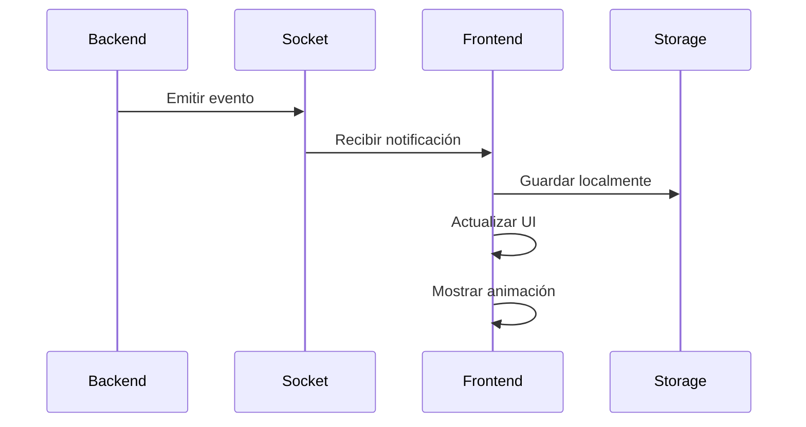

# 🔔 Sistema de Notificaciones - MussikOn

## 📋 **Resumen Ejecutivo**

El sistema de notificaciones de MussikOn es una implementación avanzada que combina **notificaciones en tiempo real** con **persistencia local** para proporcionar una experiencia de usuario fluida y confiable. El sistema está completamente integrado con Socket.IO y AsyncStorage para garantizar que los usuarios nunca pierdan información importante.

---

## 🎯 **Características Principales**

### ✅ **Funcionalidades Implementadas**
- **Notificaciones en Tiempo Real** - Socket.IO para comunicación instantánea
- **Persistencia Local** - AsyncStorage para notificaciones offline
- **Botón Flotante** - Indicador visual en header con contador
- **Pantalla Dedicada** - Gestión completa de notificaciones
- **Navegación Contextual** - Acceso directo a detalles de solicitudes
- **Marcado como Leídas** - Individual y masivo
- **Eliminación** - Individual y masiva
- **Animaciones** - Feedback visual con animaciones suaves

---

## 🏗️ **Arquitectura del Sistema**

### 📱 **Frontend Components**

#### **1. FloatingNotificationButton**
```typescript
// src/components/notifications/FloatingNotificationButton.tsx
interface FloatingNotificationButtonProps {
  onPress: () => void;
}

const FloatingNotificationButton: React.FC<FloatingNotificationButtonProps> = ({ onPress }) => {
  const [unreadCount, setUnreadCount] = useState(0);
  const [pulseAnim] = useState(new Animated.Value(1));

  // Animación de pulso cuando hay notificaciones
  const startPulseAnimation = () => {
    Animated.loop(
      Animated.sequence([
        Animated.timing(pulseAnim, {
          toValue: 1.1,
          duration: 1000,
          useNativeDriver: true,
        }),
        Animated.timing(pulseAnim, {
          toValue: 1,
          duration: 1000,
          useNativeDriver: true,
        }),
      ])
    ).start();
  };

  return (
    <Animated.View style={[styles.container, { transform: [{ scale: pulseAnim }] }]}>
      <TouchableOpacity style={styles.button} onPress={onPress}>
        <Ionicons name="notifications" size={18} color="#fff" />
        {unreadCount > 0 && (
          <View style={styles.badge}>
            <Text style={styles.badgeText}>
              {unreadCount > 99 ? '99+' : unreadCount.toString()}
            </Text>
          </View>
        )}
      </TouchableOpacity>
    </Animated.View>
  );
};
```

#### **2. NotificationsScreen**
```typescript
// src/screens/notifications/NotificationsScreen.tsx
const NotificationsScreen: React.FC = () => {
  const [notifications, setNotifications] = useState<Notification[]>([]);
  const [loading, setLoading] = useState(true);

  useEffect(() => {
    loadNotifications();
  }, []);

  const loadNotifications = async () => {
    try {
      const storedNotifications = await notificationService.getNotifications();
      setNotifications(storedNotifications);
    } catch (error) {
      console.error('Error al cargar notificaciones:', error);
    } finally {
      setLoading(false);
    }
  };

  const markAsRead = async (notificationId: string) => {
    await notificationService.markAsRead(notificationId);
    loadNotifications();
  };

  const deleteNotification = async (notificationId: string) => {
    await notificationService.deleteNotification(notificationId);
    loadNotifications();
  };

  return (
    <View style={styles.container}>
      <Header title="Notificaciones" />
      {loading ? (
        <LoadingSpinner />
      ) : (
        <FlatList
          data={notifications}
          keyExtractor={(item) => item.id}
          renderItem={({ item }) => (
            <NotificationItem
              notification={item}
              onPress={() => handleNotificationPress(item)}
              onDelete={() => deleteNotification(item.id)}
            />
          )}
        />
      )}
    </View>
  );
};
```

#### **3. NotificationItem**
```typescript
// src/components/notifications/NotificationItem.tsx
interface NotificationItemProps {
  notification: Notification;
  onPress: () => void;
  onDelete: () => void;
}

const NotificationItem: React.FC<NotificationItemProps> = ({
  notification,
  onPress,
  onDelete,
}) => {
  const { theme } = useTheme();

  const getNotificationIcon = () => {
    switch (notification.type) {
      case 'request_cancelled':
        return 'close-circle';
      case 'request_cancelled_by_musician':
        return 'musical-notes';
      case 'request_deleted':
        return 'trash';
      case 'musician_accepted':
        return 'checkmark-circle';
      default:
        return 'notifications';
    }
  };

  const getNotificationColor = () => {
    switch (notification.type) {
      case 'request_cancelled':
      case 'request_cancelled_by_musician':
      case 'request_deleted':
        return theme.colors.error[500];
      case 'musician_accepted':
        return theme.colors.success[500];
      default:
        return theme.colors.primary[500];
    }
  };

  return (
    <TouchableOpacity
      style={[
        styles.container,
        { backgroundColor: theme.colors.background.card },
        !notification.read && styles.unread,
      ]}
      onPress={onPress}
    >
      <View style={styles.iconContainer}>
        <Ionicons
          name={getNotificationIcon()}
          size={24}
          color={getNotificationColor()}
        />
      </View>
      <View style={styles.content}>
        <Text style={styles.title}>{notification.title}</Text>
        <Text style={styles.message}>{notification.message}</Text>
        <Text style={styles.timestamp}>
          {formatTimestamp(notification.timestamp)}
        </Text>
      </View>
      <TouchableOpacity style={styles.deleteButton} onPress={onDelete}>
        <Ionicons name="trash" size={20} color={theme.colors.text.secondary} />
      </TouchableOpacity>
    </TouchableOpacity>
  );
};
```

### 🔌 **Backend Services**

#### **1. NotificationService**
```typescript
// app_mussikon_express/src/services/NotificationService.ts
export class NotificationService {
  private io: any;

  constructor(io: any) {
    this.io = io;
  }

  async sendNewRequestNotification(event: Event) {
    try {
      // Buscar músicos disponibles
      const availableMusicians = await this.getAvailableMusicians();
      
      // Enviar notificación a todos los músicos conectados
      availableMusicians.forEach(musician => {
        this.io.to(musician.socketId).emit('new_event_request', {
          eventId: event.id,
          event: event,
          timestamp: new Date().toISOString(),
        });
      });
    } catch (error) {
      console.error('Error enviando notificación de nueva solicitud:', error);
    }
  }

  async sendRequestCancelledNotification(eventId: string, cancelledBy: string) {
    try {
      const event = await Event.findById(eventId);
      if (!event) return;

      // Notificar al músico asignado
      if (event.assignedMusicianId) {
        const musician = await User.findOne({ userEmail: event.assignedMusicianId });
        if (musician?.socketId) {
          this.io.to(musician.socketId).emit('request_cancelled', {
            eventId: eventId,
            cancelledBy: cancelledBy,
            event: event,
            timestamp: new Date().toISOString(),
          });
        }
      }

      // Notificar al organizador
      const organizer = await User.findOne({ userEmail: event.organizerId });
      if (organizer?.socketId) {
        this.io.to(organizer.socketId).emit('request_cancelled', {
          eventId: eventId,
          cancelledBy: cancelledBy,
          event: event,
          timestamp: new Date().toISOString(),
        });
      }
    } catch (error) {
      console.error('Error enviando notificación de cancelación:', error);
    }
  }

  async sendMusicianAcceptedNotification(eventId: string, musicianId: string) {
    try {
      const event = await Event.findById(eventId);
      if (!event) return;

      // Notificar al organizador
      const organizer = await User.findOne({ userEmail: event.organizerId });
      if (organizer?.socketId) {
        this.io.to(organizer.socketId).emit('musician_accepted', {
          eventId: eventId,
          musicianId: musicianId,
          event: event,
          timestamp: new Date().toISOString(),
        });
      }
    } catch (error) {
      console.error('Error enviando notificación de aceptación:', error);
    }
  }
}
```

#### **2. Socket Events**
```typescript
// app_mussikon_express/src/sockets/eventSocket.ts
export const initializeSocket = (server: HttpServer, users: Map<string, string>) => {
  const io = new Server(server, {
    cors: {
      origin: "*",
      methods: ["GET", "POST"]
    }
  });

  io.on('connection', (socket) => {
    console.log('Usuario conectado:', socket.id);

    // Autenticación de usuario
    socket.on('authenticate', (data) => {
      const { userEmail } = data;
      users.set(userEmail, socket.id);
      socket.join(userEmail);
      console.log('Usuario autenticado:', userEmail);
    });

    // Desconexión
    socket.on('disconnect', () => {
      for (const [email, socketId] of users.entries()) {
        if (socketId === socket.id) {
          users.delete(email);
          break;
        }
      }
      console.log('Usuario desconectado:', socket.id);
    });
  });

  return io;
};
```

### 💾 **Persistencia Local**

#### **1. NotificationService (Frontend)**
```typescript
// src/services/notificationService.ts
const NOTIFICATIONS_KEY = '@mussikon_notifications';

export const notificationService = {
  async saveNotification(notification: Notification): Promise<void> {
    try {
      const existingNotifications = await this.getNotifications();
      const updatedNotifications = [notification, ...existingNotifications];
      
      await AsyncStorage.setItem(
        NOTIFICATIONS_KEY, 
        JSON.stringify(updatedNotifications)
      );
    } catch (error) {
      console.error('Error al guardar notificación:', error);
    }
  },

  async getNotifications(userId?: string): Promise<Notification[]> {
    try {
      const notificationsJson = await AsyncStorage.getItem(NOTIFICATIONS_KEY);
      const notifications: Notification[] = notificationsJson 
        ? JSON.parse(notificationsJson) 
        : [];
      
      if (userId) {
        return notifications.filter(n => n.userId === userId);
      }
      
      return notifications;
    } catch (error) {
      console.error('Error al obtener notificaciones:', error);
      return [];
    }
  },

  async markAsRead(notificationId: string): Promise<void> {
    try {
      const notifications = await this.getNotifications();
      const updatedNotifications = notifications.map(n => 
        n.id === notificationId ? { ...n, read: true } : n
      );
      
      await AsyncStorage.setItem(
        NOTIFICATIONS_KEY, 
        JSON.stringify(updatedNotifications)
      );
    } catch (error) {
      console.error('Error al marcar notificación como leída:', error);
    }
  },

  async deleteNotification(notificationId: string): Promise<void> {
    try {
      const notifications = await this.getNotifications();
      const updatedNotifications = notifications.filter(n => n.id !== notificationId);
      
      await AsyncStorage.setItem(
        NOTIFICATIONS_KEY, 
        JSON.stringify(updatedNotifications)
      );
    } catch (error) {
      console.error('Error al eliminar notificación:', error);
    }
  },

  async getUnreadCount(): Promise<number> {
    try {
      const notifications = await this.getNotifications();
      return notifications.filter(n => !n.read).length;
    } catch (error) {
      console.error('Error al obtener contador de no leídas:', error);
      return 0;
    }
  },

  createNotificationFromServer(data: any, userId: string, type: string): Notification {
    return {
      id: generateId(),
      userId: userId,
      type: type,
      title: this.getNotificationTitle(type, data),
      message: this.getNotificationMessage(type, data),
      timestamp: new Date().toISOString(),
      read: false,
      data: data,
    };
  },

  private getNotificationTitle(type: string, data: any): string {
    switch (type) {
      case 'request_cancelled':
        return 'Solicitud Cancelada';
      case 'request_cancelled_by_musician':
        return 'Músico Canceló';
      case 'request_deleted':
        return 'Solicitud Eliminada';
      case 'musician_accepted':
        return 'Músico Aceptó';
      default:
        return 'Nueva Notificación';
    }
  },

  private getNotificationMessage(type: string, data: any): string {
    switch (type) {
      case 'request_cancelled':
        return `La solicitud "${data.event?.eventType}" ha sido cancelada`;
      case 'request_cancelled_by_musician':
        return `El músico canceló la solicitud "${data.event?.eventType}"`;
      case 'request_deleted':
        return `La solicitud "${data.event?.eventType}" ha sido eliminada`;
      case 'musician_accepted':
        return `Un músico aceptó tu solicitud "${data.event?.eventType}"`;
      default:
        return 'Tienes una nueva notificación';
    }
  },
};
```

---

## 🔄 **Flujo de Notificaciones**

### 📱 **1. Recepción de Notificación**


### 🔔 **2. Tipos de Notificaciones**

#### **Eventos de Solicitudes**
- **`new_event_request`** - Nueva solicitud disponible para músicos
- **`request_cancelled`** - Solicitud cancelada por organizador
- **`request_cancelled_by_musician`** - Solicitud cancelada por músico
- **`request_deleted`** - Solicitud eliminada
- **`musician_accepted`** - Músico aceptó la solicitud
- **`request_completed`** - Solicitud completada

#### **Estructura de Datos**
```typescript
interface Notification {
  id: string;
  userId: string;
  type: 'request_cancelled' | 'request_cancelled_by_musician' | 'request_deleted' | 'musician_accepted';
  title: string;
  message: string;
  timestamp: string;
  read: boolean;
  data: any;
}
```

### 🎯 **3. Estados de Notificación**
- **`unread`** - No leída (mostrar badge)
- **`read`** - Leída (sin badge)
- **`deleted`** - Eliminada (no mostrar)

---

## 🎨 **UI/UX Features**

### 🔔 **Botón Flotante**
- **Posición**: Header, no intrusivo
- **Animación**: Pulso cuando hay notificaciones nuevas
- **Badge**: Contador de no leídas
- **Accesibilidad**: Touch target adecuado

### 📱 **Pantalla de Notificaciones**
- **Lista**: Scroll infinito con FlatList
- **Estados**: Loading, empty, error
- **Acciones**: Marcar como leída, eliminar
- **Navegación**: Ir a detalles de solicitud

### 🎨 **Diseño Visual**
- **Iconos**: Específicos por tipo de notificación
- **Colores**: Consistentes con el tema
- **Tipografía**: Jerarquía clara
- **Espaciado**: Respeta guidelines de diseño

---

## 🔧 **Configuración y Setup**

### 📱 **Frontend Setup**
```typescript
// src/App.tsx
import { NotificationProvider } from './contexts/NotificationContext';

const App = () => {
  return (
    <NotificationProvider>
      <SocketProvider>
        <NavigationContainer>
          {/* App content */}
        </NavigationContainer>
      </SocketProvider>
    </NotificationProvider>
  );
};
```

### 🔌 **Backend Setup**
```typescript
// app_mussikon_express/index.ts
import { NotificationService } from './src/services/NotificationService';

const server = http.createServer(app);
const io = initializeSocket(server, users);

// Inicializar servicio de notificaciones
const notificationService = new NotificationService(io);
```

---

## 🚀 **Optimizaciones Implementadas**

### ⚡ **Performance**
- **Lazy Loading**: Notificaciones cargan bajo demanda
- **Memoization**: Componentes optimizados con React.memo
- **Debouncing**: Evita múltiples llamadas simultáneas
- **Caching**: Notificaciones en memoria para acceso rápido

### 🔒 **Seguridad**
- **Validación**: Verificación de datos de entrada
- **Sanitización**: Limpieza de contenido HTML
- **Autenticación**: Verificación de usuario antes de enviar
- **Rate Limiting**: Límites en envío de notificaciones

### 📱 **UX/UI**
- **Feedback Visual**: Animaciones suaves
- **Estados de Carga**: Loading spinners apropiados
- **Manejo de Errores**: Mensajes claros al usuario
- **Accesibilidad**: Soporte para lectores de pantalla

---

## 🐛 **Troubleshooting Común**

### ❌ **Problemas de Conexión**
```typescript
// Verificar conexión de Socket.IO
socket.on('connect_error', (error) => {
  console.error('Error de conexión:', error);
  // Implementar reconexión automática
});
```

### 📱 **Problemas de Persistencia**
```typescript
// Verificar AsyncStorage
const testStorage = async () => {
  try {
    await AsyncStorage.setItem('test', 'value');
    const value = await AsyncStorage.getItem('test');
    console.log('AsyncStorage funciona:', value === 'value');
  } catch (error) {
    console.error('Error en AsyncStorage:', error);
  }
};
```

### 🔔 **Notificaciones No Llegan**
```typescript
// Verificar eventos de Socket.IO
socket.on('connect', () => {
  console.log('Socket conectado');
  socket.emit('authenticate', { userEmail: user.email });
});
```

---

## 📊 **Métricas y Analytics**

### 📈 **Métricas Implementadas**
- **Tasa de Entrega**: Porcentaje de notificaciones entregadas
- **Tiempo de Respuesta**: Latencia de entrega
- **Tasa de Lectura**: Porcentaje de notificaciones leídas
- **Engagement**: Interacciones con notificaciones

### 📊 **Logging**
```typescript
// Logging de eventos de notificación
const logNotificationEvent = (event: string, data: any) => {
  console.log(`[NOTIFICATION] ${event}:`, {
    timestamp: new Date().toISOString(),
    userId: data.userId,
    type: data.type,
    ...data
  });
};
```

---

## 🎯 **Próximas Mejoras**

### 🚀 **Corto Plazo**
1. **Push Notifications** - Notificaciones nativas del sistema
2. **Notificaciones Push** - Firebase Cloud Messaging
3. **Filtros Avanzados** - Filtrar por tipo y fecha
4. **Búsqueda** - Buscar en notificaciones

### 🔮 **Mediano Plazo**
1. **Notificaciones Programadas** - Envío diferido
2. **Plantillas** - Notificaciones personalizables
3. **Analytics Avanzados** - Métricas detalladas
4. **A/B Testing** - Optimización de engagement

### 🎯 **Largo Plazo**
1. **IA para Notificaciones** - Personalización inteligente
2. **Notificaciones Multicanal** - Email, SMS, Push
3. **Automatización** - Notificaciones automáticas
4. **Integración con Calendario** - Recordatorios de eventos

---

## 📝 **Conclusión**

El sistema de notificaciones de MussikOn es una implementación robusta y escalable que proporciona una experiencia de usuario excepcional. Combina la velocidad del tiempo real con la confiabilidad de la persistencia local, asegurando que los usuarios nunca pierdan información importante.

**Estado**: ✅ **Completamente Implementado y Funcional**  
**Última actualización**: Diciembre 2024  
**Próxima revisión**: Según nuevas funcionalidades 