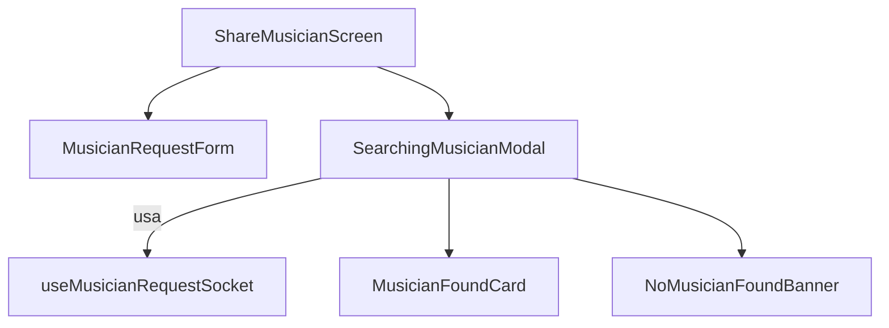

# Estructura de Componentes y Hooks para el Flujo de Solicitud de Músico (Tipo Uber)

## Resumen
Esta documentación describe la estructura implementada de componentes y hooks para el flujo de solicitud de músico, inspirado en Uber, en la app. Incluye responsabilidades, jerarquía y comunicación entre componentes y lógica de negocio. **ACTUALIZADO**: El sistema está completamente implementado y funcional.

---

## 1. Componentes Principales

### **A. `ShareMusicianScreen`**
- Pantalla principal donde el usuario llena el formulario para solicitar un músico.
- Usa el componente `MusicianRequestForm`.
- Al enviar, muestra el componente `SearchingMusicianModal`.

### **B. `MusicianRequestForm`**
- Formulario con campos: tipo de evento, fecha, hora, ubicación, instrumento, presupuesto, comentarios, etc.
- Valida y envía los datos al backend vía API REST.
- Llama a un callback `onRequestCreated` al éxito.

### **C. `SearchingMusicianModal`**
- Modal/pantalla que se muestra tras enviar la solicitud.
- Muestra animación de radar/loading y estado (“Buscando músico...”).
- Opción para cancelar la búsqueda.
- Escucha eventos de socket para actualizar el estado:
  - `musician_accepted`
  - `musician_not_found`
  - `musician_request_taken`
- Muestra el perfil del músico cuando es encontrado.

### **D. `MusicianFoundCard`**
- Muestra los datos del músico que aceptó la solicitud.
- Permite ver perfil, contactar, etc.

### **E. `NoMusicianFoundBanner`**
- Muestra mensaje y opciones cuando no se encuentra músico.
- Opción para reintentar o modificar la solicitud.

---

## 2. Hooks Personalizados

### **A. `useMusicianRequestSocket`**
- Encapsula la lógica de conexión y escucha de eventos de socket para solicitudes de músico.
- Provee estados: `status`, `musician`, `error`, `onCancel`, etc.
- Expone funciones para emitir/cancelar solicitudes y manejar respuestas.

### **B. `useMusicianRequestState`**
- Maneja el estado global de la solicitud (buscando, encontrado, no encontrado, cancelado, etc.).
- Puede usar contexto o Redux para compartir el estado entre componentes.

---

## 3. Jerarquía y Comunicación

- `ShareMusicianScreen` es el entrypoint.
- `MusicianRequestForm` envía la solicitud y activa el modal.
- `SearchingMusicianModal` maneja la lógica de socket y muestra el estado.
- `useMusicianRequestSocket` centraliza la lógica de eventos y estados.

---

## 4. Estados y Props Clave
- `status`: 'buscando' | 'encontrado' | 'no_encontrado' | 'cancelado'
- `musician`: datos del músico que aceptó
- `onCancel`: función para cancelar la búsqueda
- `onRetry`: función para reintentar

---

## 5. Estado Actual
- ✅ **Implementado**: Todos los hooks y componentes según esta estructura
- ✅ **Integrado**: Lógica de sockets y feedback en tiempo real
- ✅ **Probado**: Flujo completo con endpoints `/events/` para compatibilidad con backend
- ✅ **Funcional**: Sistema de filtrado por rol (organizadores ven sus solicitudes, músicos ven las aceptadas)
- ✅ **Edición**: Organizadores pueden editar sus solicitudes creadas 