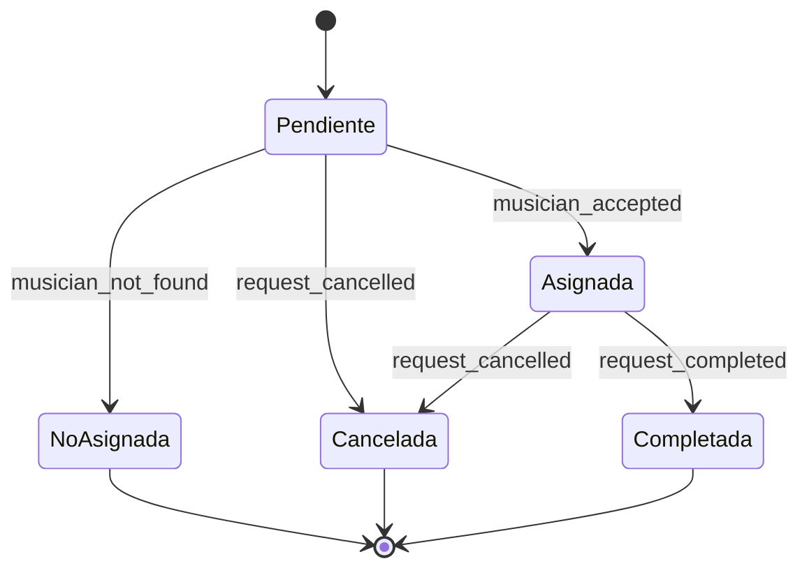

# Flujo de Matching y Estados Globales (Solicitudes de Músico tipo Uber)

## Resumen
Este documento describe el flujo de matching y los estados globales para el sistema de solicitud de músico, inspirado en el modelo Uber. Explica cómo se gestiona el matching entre usuarios y músicos, los estados posibles de una solicitud y los eventos clave del sistema.

---

## 1. Matching en Tiempo Real
- Cuando un usuario crea una solicitud de músico:
  - El backend la almacena y la marca como “pendiente”.
  - Se emite un evento por socket (`new_event_request`) a todos los músicos conectados y disponibles.
- Los músicos reciben la solicitud y pueden “Aceptar” o “Rechazar”.
- El **primer músico** que acepte la solicitud la toma (“first come, first served”).
- El backend bloquea la solicitud para otros músicos y emite eventos de actualización de estado.
- **NUEVO:** Ahora, tanto músicos como organizadores pueden ver todas sus solicitudes/eventos en progreso desde la pantalla "Mis Solicitudes", accesible desde el menú lateral. Esta pantalla incluye tabs para alternar entre pendientes, asignados/agendados y todos, con una UI moderna y feedback visual inmediato.

---

## 2. Estados Globales de la Solicitud
- **pendiente**: Esperando que un músico acepte.
- **asignada**: Un músico ha aceptado y la solicitud está en proceso.
- **no_asignada**: Nadie aceptó en el tiempo límite.
- **cancelada**: El usuario canceló la solicitud.
- **completada**: El evento fue realizado y cerrado.
- **rechazada**: El músico rechazó la solicitud (solo para el músico específico).

---

## 3. Eventos Clave (Socket y API)
- `new_event_request`: Nueva solicitud enviada a músicos.
- `musician_accepted`: Un músico aceptó la solicitud (emitido a usuario y otros músicos).
- `musician_request_taken`: Notifica a los músicos que la solicitud ya fue tomada.
- `musician_not_found`: Nadie aceptó en el tiempo límite (emitido a usuario).
- `request_cancelled`: El usuario canceló la solicitud (emitido a músicos).
- `request_completed`: El evento fue realizado y cerrado.

---

## 4. Lógica de Negocio Recomendada
- El backend debe manejar el “lock” de la solicitud para evitar que más de un músico la acepte.
- El frontend debe escuchar los eventos de socket y actualizar la UI en tiempo real.
- El usuario puede cancelar la solicitud mientras está “pendiente”.
- Los músicos pueden rechazar sin penalización, pero solo el primero que acepte la toma.
- El sistema debe manejar reintentos si no se encuentra músico.
- **NUEVO:** La pantalla "Mis Solicitudes" permite a los usuarios gestionar y visualizar el estado de todas sus solicitudes/eventos de forma centralizada y moderna.

---

## 5. Diagrama de Estados (Mermaid)

---

## 6. Siguientes pasos
- Implementar la lógica de matching y estados en el backend.
- Integrar la escucha y actualización de estados en el frontend.
- **Probar el flujo completo con múltiples músicos conectados y la pantalla de "Mis Solicitudes".** 