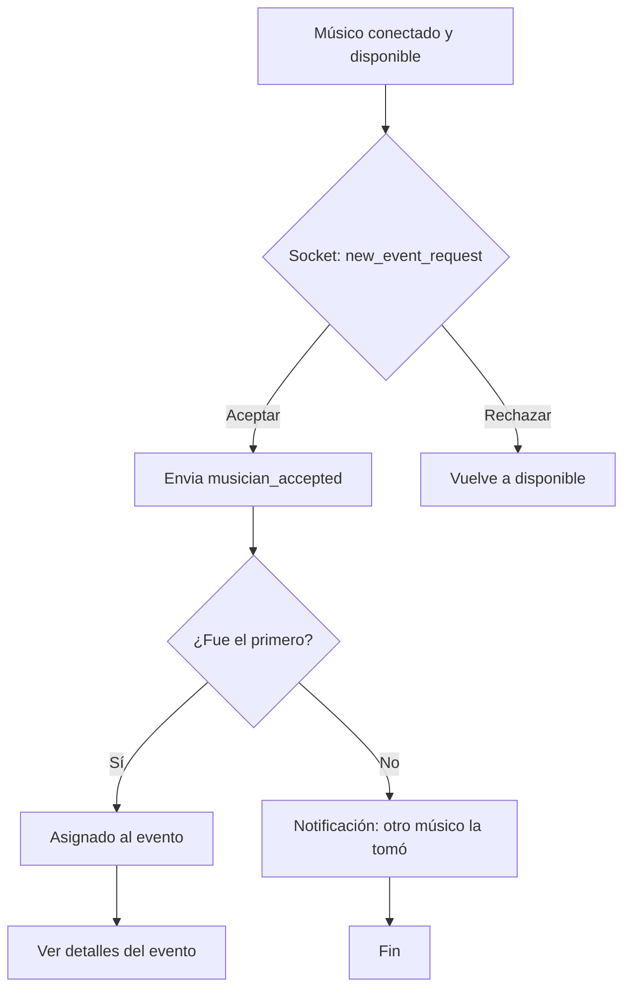

# Flujo del Músico que Recibe Solicitudes (Estilo Uber)

## Resumen
Este documento describe el flujo completo y la lógica de negocio para la funcionalidad del músico que recibe y responde a solicitudes, inspirado en la experiencia de apps como Uber Driver. Incluye los pasos, estados, eventos y recomendaciones de UI/UX para una experiencia moderna y en tiempo real.

---

## 1. Recepción de Solicitud
- El músico está conectado y disponible (app en estado “online”).
- Recibe una notificación en tiempo real por socket (`new_event_request`).
- Se muestra un banner/modal con los detalles de la solicitud:
  - Tipo de evento
  - Fecha y hora
  - Ubicación
  - Instrumento requerido
  - Presupuesto
  - Comentarios
- Opción para “Aceptar” o “Rechazar”.
- **NUEVO:** El músico puede acceder a la pantalla "Mis Solicitudes" desde el menú lateral, donde puede ver y gestionar todas las solicitudes/eventos en los que participa, alternar entre tabs (agendados, todos) y recibir feedback visual inmediato sobre el estado de cada solicitud.

---

## 2. Decisión del Músico
- Si el músico **acepta**:
  - Se envía confirmación por socket y API (`musician_accepted`).
  - El sistema bloquea la solicitud para otros músicos (solo el primero la toma).
  - El músico ve pantalla de “Esperando confirmación del evento” o “Evento asignado”.
- Si el músico **rechaza**:
  - La solicitud sigue disponible para otros músicos.
  - El músico vuelve al estado “Disponible”.

---

## 3. Estados de la Solicitud para el Músico
- **Nueva solicitud**: Banner/modal con detalles y acciones.
- **Esperando confirmación**: Si aceptó primero, espera confirmación del usuario/evento.
- **Asignado**: El evento es suyo, ve los detalles completos y puede comunicarse con el organizador.
- **No asignado**: Si otro músico aceptó primero, recibe notificación de “Solicitud tomada por otro músico”.

---

## 4. Feedback y Notificaciones
- Notificaciones en tiempo real para cada cambio de estado.
- Animaciones y banners para mejorar la experiencia.
- Mensajes claros en cada estado (“¡Fuiste asignado!”, “Solicitud tomada por otro músico”, etc.).
- **NUEVO:** UI moderna y centralizada para la gestión de solicitudes en la pantalla "Mis Solicitudes".

---

## 5. Recomendaciones de UI/UX
- Banner/modal grande y claro para nuevas solicitudes.
- Botones grandes y separados para “Aceptar” y “Rechazar”.
- Feedback inmediato al aceptar/rechazar (loading, animación, vibración).
- Mostrar detalles completos del evento al ser asignado.
- Contraste y accesibilidad en todos los textos y botones.
- Animación de “esperando” si está en proceso de asignación.
- **NUEVO:** Gestión centralizada de solicitudes/eventos en la pantalla "Mis Solicitudes".

---

## 6. Eventos y Endpoints Clave
- **Socket**: Escuchar `new_event_request` (nueva solicitud)
- **API REST**: GET `/events/my-scheduled`, `/events/my-events` (ver solicitudes)
- **API REST**: POST `/events/{eventId}/accept` (aceptar solicitud)
- **Socket**: Emitir `musician_accepted` al aceptar
- **Socket**: Escuchar `musician_request_taken` (si otro músico la tomó)

---

## 7. Diagrama de Flujo (Mermaid)

---

## 8. Siguientes pasos
- Implementar la lógica de recepción y respuesta de solicitudes por socket.
- Crear el banner/modal de nueva solicitud.
- Integrar feedback y animaciones.
- **NUEVO:** Probar y documentar la pantalla "Mis Solicitudes" para la gestión centralizada de solicitudes/eventos. 