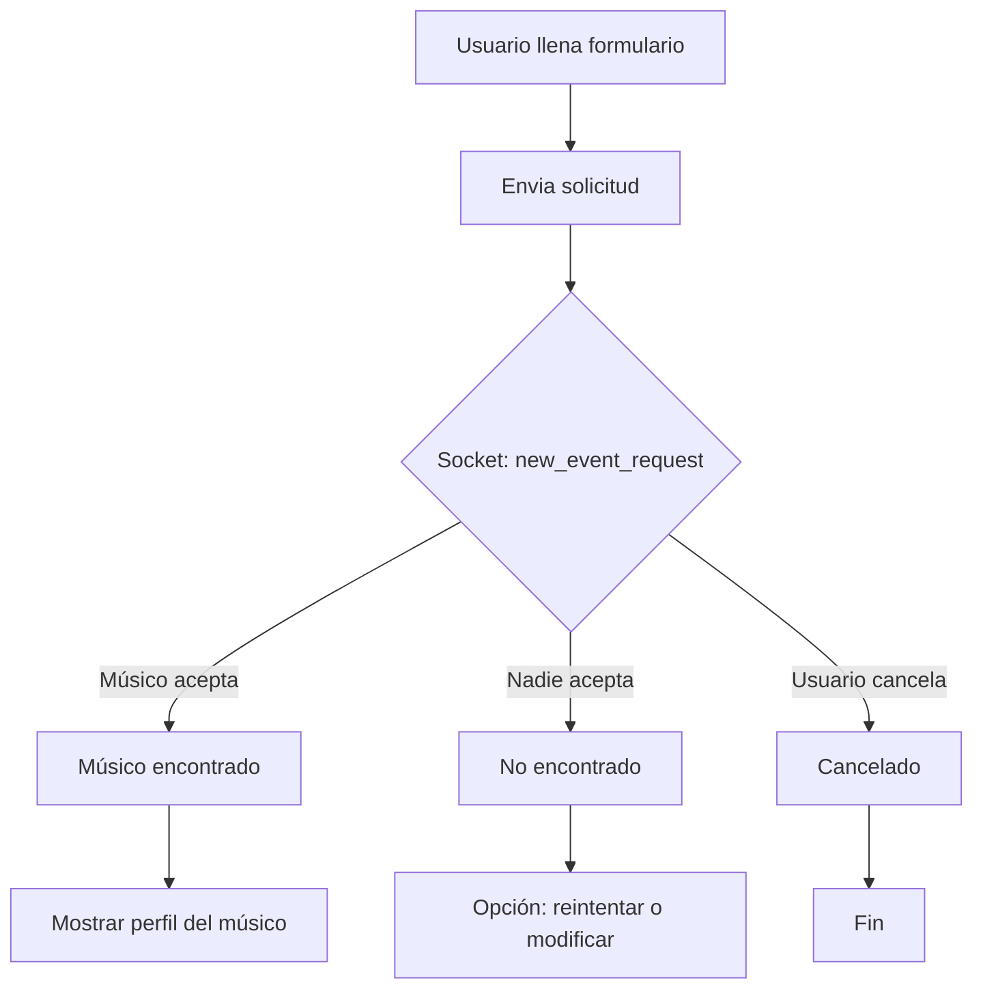

# Flujo del Usuario que Solicita Músico (Estilo Uber)

## Resumen
Este documento describe el flujo completo y la lógica de negocio para la funcionalidad de solicitar un músico, inspirado en la experiencia de apps como Uber. Incluye los pasos, estados, eventos y recomendaciones de UI/UX para una experiencia moderna y en tiempo real.

---

## 1. Formulario de Solicitud
- El usuario llena un formulario con:
  - Tipo de evento
  - Fecha y hora
  - Ubicación
  - Instrumento requerido
  - Presupuesto
  - Comentarios adicionales
- Validación de datos obligatorios.
- Al enviar:
  - Se crea la solicitud en el backend (API REST).
  - Se emite un evento por socket (`new_event_request`) a los músicos conectados y disponibles.

---

## 2. Estado: Buscando Músico
- El usuario ve una pantalla/modal/banner con animación (radar, loading, etc.).
- Mensaje: “Buscando músico disponible...”
- Opción para cancelar la búsqueda.
- El frontend escucha por socket la respuesta de los músicos.

---

## 3. Matching y Respuesta
- Si un músico acepta:
  - El usuario recibe notificación en tiempo real.
  - Se muestra el perfil del músico y el estado (“Músico en camino”, “Confirmado”, etc.).
- Si nadie acepta en X tiempo:
  - Mensaje: “No se encontró músico disponible.”
  - Opción para reintentar o modificar la solicitud.

---

## 4. Estados de la Solicitud
- **Buscando**: Esperando respuesta de músicos.
- **Encontrado**: Un músico aceptó la solicitud.
- **No encontrado**: Nadie aceptó en el tiempo límite.
- **Cancelado**: El usuario canceló la búsqueda.

---

## 5. Feedback y Notificaciones
- Notificaciones en tiempo real (socket) para cada cambio de estado.
- Animaciones y banners para mejorar la experiencia.
- Mensajes motivacionales y claros en cada estado.
- **NUEVO:** El usuario puede acceder a la pantalla "Mis Solicitudes" desde el menú lateral, donde puede ver y gestionar todas sus solicitudes en progreso, alternar entre tabs (pendientes, asignadas, todas) y recibir feedback visual inmediato sobre el estado de cada solicitud.

---

## 6. Recomendaciones de UI/UX
- Botón grande y claro para enviar la solicitud.
- Animación de radar o loading mientras se busca músico.
- Feedback inmediato al usuario en cada estado.
- Opción para cancelar la búsqueda en cualquier momento.
- Mostrar perfil y datos del músico cuando se acepta la solicitud.
- Contraste y accesibilidad en todos los textos y botones.
- **NUEVO:** UI moderna y centralizada para la gestión de solicitudes en la pantalla "Mis Solicitudes".

---

## 7. Eventos y Endpoints Clave
- **API REST**: POST `/events/request-musician` (crear solicitud)
- **API REST**: GET `/events/my-pending`, `/events/my-assigned`, `/events/my-events` (ver solicitudes)
- **Socket**: Emitir `new_event_request` al crear solicitud
- **Socket**: Escuchar `musician_accepted` y `musician_not_found`

---

## 8. Diagrama de Flujo (Mermaid)

---

## 9. Siguientes pasos
- Implementar la lógica de envío y escucha de sockets en el frontend.
- Crear la pantalla/modal de “Buscando músico...”.
- Integrar feedback y animaciones.
- **NUEVO:** Probar y documentar la pantalla "Mis Solicitudes" para la gestión centralizada de solicitudes. 