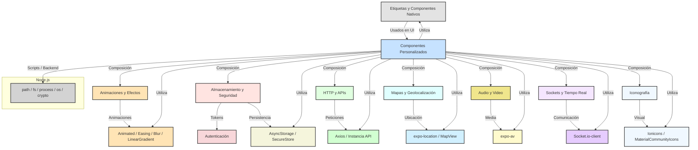

# 📚 Índice y Guía de Tecnologías, Componentes y Utilidades

## 🗺️ Diagrama Visual de la Arquitectura y Tecnologías

---

Este documento es el índice central y guía de navegación para toda la documentación técnica de etiquetas, componentes, APIs, funciones nativas y utilitarias usadas en el proyecto.

---

## 🏷️ **Etiquetas y Componentes Nativos de React Native**
- [Text](./tags/Text.md)
- [View](./tags/View.md)
- [TouchableOpacity](./tags/TouchableOpacity.md)
- [Pressable](./tags/Pressable.md)
- [ScrollView](./tags/ScrollView.md)
- [FlatList](./tags/FlatList.md)
- [SectionList](./tags/SectionList.md)
- [TextInput](./tags/TextInput.md)
- [KeyboardAvoidingView](./tags/KeyboardAvoidingView.md)
- [Modal](./tags/Modal.md)
- [Image](./tags/Image.md)
- [ActivityIndicator](./tags/ActivityIndicator.md)
- [StatusBar](./tags/StatusBar.md)
- [Platform](./tags/Platform.md)

## 🎨 **Componentes Personalizados del Proyecto**
- [Button](./tags/Button.md)
- [Card](./tags/Card.md)
- [FAB (Floating Action Button)](./tags/FAB.md)
- [SlideButton](./tags/SlideButton.md)
- [Input](./tags/Input.md)
- [Header](./tags/Header.md)
- [LoadingSpinner](./tags/LoadingSpinner.md)
- [LoadingModal](./tags/LoadingModal.md)
- [LanguageSelector](./tags/LanguageSelector.md)
- [UserList](./tags/UserList.md)
- [BottomNavigation](./tags/BottomNavigation.md)
- [BottomMenu](./tags/BottomMenu.md)
- [AnimatedBackground](./tags/AnimatedBackground.md)
- [AlertModal](./tags/AlertModal.md)
- [Sidebar (MainSidebar)](./tags/Sidebar.md)
- [DateTimePicker/DateTimeSelector](./tags/DateTimePicker.md)

## 🗺️ **Componentes de Mapas y Geolocalización**
- [MapView (react-native-maps)](./tags/MapView.md)
- [expo-location](./tags/ExpoLocation.md)

## 🖼️ **Imágenes, Gradientes y Efectos Visuales**
- [expo-linear-gradient](./tags/ExpoLinearGradient.md)
- [expo-blur](./tags/ExpoBlur.md)
- [expo-image-picker](./tags/ExpoImagePicker.md)

## 🔊 **Audio y Video**
- [expo-av](./tags/ExpoAV.md)

## 💬 **Sockets y Comunicación en Tiempo Real**
- [Socket.io-client](./tags/Socket.md)
- [useSocket (hook personalizado)](../hooks/useSocket.tsx)

## 🛠️ **Animaciones y Easing**
- [Animated.View y Animated.Text](./tags/Animated.md)
- [Animated.spring](./tags/AnimatedSpring.md)
- [Animated.timing](./tags/AnimatedTiming.md)
- [Easing](./tags/Easing.md)

## 🗄️ **Almacenamiento y Seguridad**
- [AsyncStorage](./tags/AsyncStorage.md)
- [SecureStore](./tags/SecureStore.md)

## 🔑 **Autenticación y Tokens**
- [jwt-decode](./tags/jwtDecode.md)

## 🌐 **HTTP y APIs**
- [Axios](./tags/Axios.md)
- [Instancia personalizada de Axios (api)](./tags/axiosInstance.md)

## 🎵 **Iconografía**
- [Ionicons](./tags/Ionicons.md)
- [MaterialCommunityIcons](./tags/MaterialCommunityIcons.md)

## ⚙️ **Node.js: Funciones y Módulos Nativos**
- [path](./tags/NodePath.md)
- [fs](./tags/NodeFs.md)
- [process](./tags/NodeProcess.md)
- [os](./tags/NodeOs.md)
- [crypto](./tags/NodeCrypto.md)

---

### 📝 **Cómo Navegar esta Documentación**
- Cada archivo explica: **origen**, **qué hace**, **cómo se usa** (con ejemplos), **ejemplo real** y **por qué se eligió**.
- Los componentes personalizados están agrupados por funcionalidad para facilitar la búsqueda.
- Los módulos nativos de Node.js están al final para referencia de backend/scripts.
- Si buscas una función utilitaria propia, revisa la documentación de cada componente o servicio relacionado.

---

**¿Buscas algo específico?**
- Usa la búsqueda de tu editor o el índice de este archivo.
- Si tienes dudas sobre la integración de varias tecnologías, revisa los ejemplos de uso real en cada archivo.

---

**Última actualización:** Diciembre 2024

**Mantenedor:** Equipo de Desarrollo MussikOn 